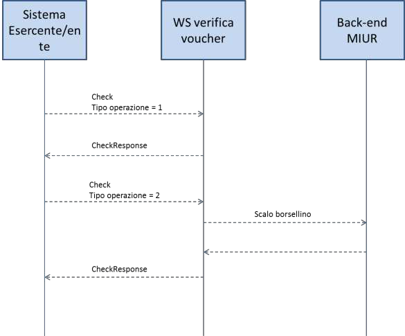

**WEB APP cartadeldocente.istruzione.it**

**LINEE GUIDA PER ESERCENTI/ENTI DI FORMAZIONE**

L'art 1, comma 121, della Legge n. 107 del 2015 (Buona Scuola) istituisce la Carta elettronica per l'aggiornamento e la formazione dei docenti di ruolo a tempo indeterminato delle Istituzioni scolastiche statali, sia a tempo pieno che a tempo parziale, compresi i docenti che sono in periodo di formazione e prova, i docenti dichiarati inidonei per motivi di salute di cui all'art. 514 del Dlgs.16/04/94, n.297, e successive modificazioni, i docenti in posizione di comando, distacco, fuori ruolo o altrimenti utilizzati, i docenti nelle scuole all'estero, delle scuole militari. L'importo della carta è di euro 500 per ogni anno scolastico e può essere utilizzata per l'acquisto dei seguenti beni o servizi:

a) libri e testi, anche in formato digitale, pubblicazioni e riviste comunque utili all'aggiornamento professionale;

b) hardware e software;

c) iscrizione a corsi per attività di aggiornamento e di qualificazione delle competenze professionali, svolti da enti accreditati presso il Ministero dell'istruzione, dell'università e della ricerca;

d) iscrizione a corsi di laurea, di laurea magistrale, specialistica o a ciclo unico, inerenti al profilo professionale, ovvero a corsi post lauream o a master universitari inerenti al profilo professionale;

e) titoli di accesso per rappresentazioni teatrali e cinematografiche;

f) titoli per l'ingresso a musei, mostre ed eventi culturali e spettacoli dal vivo;

g) iniziative coerenti con le attività individuate nell'ambito del piano triennale dell'offerta formativa delle scuole e del Piano nazionale di formazione, di cui articolo 1, comma 124, della legge n. 107 del 2015.

La gestione dei buoni di spesa può avvenire tramite qualunque tipo di device (smartphone, tablet, computer) connesso ad Internet, sia da parte dei docenti che da parte degli esercenti o degli enti di formazione (soggetti pubbilici o privati).

In particolare, nell'applicazione web gli esercenti o enti di formazione avranno a disposizione le seguenti funzionalità:

1. registrazione al servizio;

2. vendita attraverso esercizio fisico oppure on line

3. controllo e riscossione dei buoni di spesa

4. fatturazione

.. _registrazione-al-servizio:

REGISTRAZIONE AL SERVIZIO
=========================

L'applicazione cartadeldocente.istruzione.it può essere utilizzata solo dagli esercenti o dagli enti di formazione con credenziali di accesso ai Servizi Telematici dell'Agenzia delle Entrate e che hanno incaricato dei soggetti ad operare per proprio conto. Gli esercenti o gli enti di formazione si devono, quindi, obbligatoriamente registrare all'applicazione web per poter vendere i propri prodotti o servizi.

Le fasi della registrazione:

-  registrazione all'applicazione con indicazione dei dati generali dell'esercente o ente di formazione (dati anagrafici, di residenza, codice ATECO, recapiti telefonici, mail ed eventuale sito internet, accettazione della normativa vigente).

-  indicazione di categorie di prodotto e prodotti o servizi vendibili sia nel proprio esercizio fisico che in quello online.

Al termine della registrazione, il sistema assegnerà automaticamente a ciascun esercente o ente di formazione un "codice esercente" di 5 caratteri alfanumerici da utilizzare in fase di riscossione dei buoni. Gli esercenti o enti di formazione possono modificare le informazioni registrate ogni qual volta vorranno (ad esempio: variazione dati, inserimento/cancellazione dei punti vendita fisici).

.. _vendita:

VENDITA
=======

L'applicazione web mette a disposizione degli esercenti o degli enti di formazione due tipologie di vendita: nell'esercizio fisico oppure on-line (in fase di registrazione è possibile indicare l'utilizzo anche di entrambe le tipologie). In caso di vendita nell'esercizio fisico, l'esercente o l' ente di formazione può indicare tutti i punti vendita dove i docenti potranno esibire i buoni di spesa con l'indicazione delle categorie di beni o servizi disponibili. I punti vendita potranno essere geolocalizzati nell'applicazione cartadeldocente.istruzione.it.

In caso di vendita online, l'esercente o l' ente di formazione dovrà prima dotarsi di un certificato da applicare al web-service (**vd. allegato 1**) richiamabile dai propri sistemi per la verifica e validazione dei buoni di spesa.

In particolare dovrà:

-  richiedere il certificato in fase di registazione;

-  scaricare il certificato nei propri sistemi;

-  verificare l'istallazione del certificato tramite specifica chiamata del web-service, come da indicazioni in allegato1.

Si precisa che sarà possibile anche per gli esercenti o per gli enti di formazione che scelgono la vendita presso l'esercizio fisico scegliere l'utilizzo delle API services che prevedono il download ed istallazione di un certificato nei propri sistemi, secondo il procedimento descritto per la vendità online.

Si precisa, inoltre, che per gli esercenti o per gli enti di formazione che utilizzeranno il web-services per la validazione dei buoni sono previsti i seguenti stati di lavorazione legati alle attività di configurazione dei propri sistemi in cui dovrà essere istallato il certificato:

-  da attivare  certificato da scaricare dall' applicazione cartadeldocente.istruzione.it

-  attivabile  certificato scaricato, ma non istallato

-  attivo  certificato istallato (vd. allegato 1).

.. _controllo-e-riscossione-dei-buoni-di-spesa:

CONTROLLO E RISCOSSIONE DEI BUONI DI SPESA
==========================================

Gli esercenti o gli enti di formazione possono verificare e riscuotere i buoni di spesa generati dai docenti nelle funzionalità dell'applicazione loro dedicate ed identificati da uno specifico codice.

La verifica e validazione è differente in caso di vendita presso l'esercizio fisico oppure online.

.. _verifica-in-caso-di-vendita-nellesercizio-fisico:

Verifica in caso di vendita nell'esercizio fisico
-------------------------------------------------

Nell'area non autenticata dell'applicazione web gli esercenti o gli enti di formazione possono;

-  indicare il codice del buono di spesa esibito dal beneficiario insieme al "codice esercente";

-  leggere il QR code o il codice a barre del buono.

In caso di riconoscimento del codice del buono di spesa, la web app restituisce le informazioni generali dell'acquisto (categoria di prodotto, bene, importo e cognome/nome del beneficiario); eventualmente l'esercente può verificare il beneficiario anche tramite l'esibizione di un documento d'identità. A questo punto, l'esercente o l'ente di formazione può validare il buono esibito consentendo di "scalare" l'importo dal totale disponibile nel Portafoglio del docente.

.. _verifica-in-caso-di-vendita-online:

Verifica in caso di vendita online
----------------------------------

Nel proprio sito internet, l'esercente o l' ente di formazione consente al docente di indicare il codice del buono di spesa da verificare e riscuotere tramite chiamata al web-service le cui specifiche sono reperibili nell'allegato 1.

Gli esercenti o gli enti di formazione possono visualizzare la lista dei buoni riscossi utilizzando eventuali filtri di ricerca per data di generazione del buono e/o per tipologia di vendita (esercizio fisico oppure online), per categoria di prodotto e per buoni fatturati o da fatturare.

Nelle liste verrano visualizzate le seguenti informazioni:

-  categoria di beni o servizi

-  dettagli dei beni o servizi acquistati (tipologia ed esercente/punto vendita/ente di formazione)

-  identificativo del buono di spesa

-  identificativo della fattura elettronica in cui è stato indicato il bene o il servizio acquistato

-  informazione sull'eventuale download della lista esportabile in formato .csv.

Le liste visualizzate potranno essere scaricate in formato .csv per facilitare la preparazione della fattura elettronica.

Nella "lista dei buoni", resa disponibile nella web app cartadeldocente.istruzione.it, gli esercenti o gli enti di formazione possono, inoltre, verificare se il numero di buoni convalidati coincide con quello delle fatture.

.. _fatturazione:

FATTURAZIONE
============

Agli esercenti o agli enti di formazione viene riconosciuto un credito per ogni buono riscosso da dichiarare in sede di fatturazione elettronica.

L'esercente o l'ente di formazione dovrà preparare la fattura in formato elettronico secondo il tracciato stabilito per la fatturazione elettronica verso la pubblica amministrazione ("Schema del file xml FatturaPA - versione 1.1" reperibile nel sito `www.fatturapa.gov.it, <http://www.fatturapa.gov.it/>`__ sezione Norme e regole, Documentazione FatturaPA).

La valorizzazione degli elementi del tracciato xml dovrà rispettare i requisiti formali e di obbligatorietà previsti e, con particolare riferimento al blocco 2.2.1 <DettaglioLinee>, dovrà tener conto delle indicazioni riportate nel documento "**Linee guida fatturazione esercente**" disponibili nell'applicazione cartadeldocente.istruzione.it.

**ALLEGATO 1**

**Allegato 1 – Specifica WS online**

.. _cartadeldocente.istruzione.it:

cartadeldocente.istruzione.it
=============================

**Servizio Web per verifica buono di spesa degli esercenti/ enti di formazione**

Gli esercenti o gli enti di formazione registrati al servizio cartadeldocente.istruzione.it per la vendita online potranno validare nei propri sistemi i buoni di spesa di beni o servizi da parte dei docenti utilizzando un servizio web di cui si forniscono di seguito le specifiche di utilizzo.

Il servizio web di **verifica del buono** da parte degli esercenti o degli enti di formazione rende disponibili 2 principali operazioni ("**Check**" e "**Confirm**"). La seguente descrizione delle operazioni è necessaria per valorizzare adeguatamente i campi di input. Pertanto le operazioni esposte dall'interfaccia wsdl possono essere descritte come segue:

1. **Check**

+---------+------------------------------+-----------------------------+
| INPUT:  | tipo operazione              | *"1", "2"*                  |
+=========+==============================+=============================+
|         | codice buono                 |                             |
+---------+------------------------------+-----------------------------+
| OUTPUT: | nominativo beneficiario      | *CF o Nome e Cognome*       |
+---------+------------------------------+-----------------------------+
|         | partita IVA esercente ambito | *cinema, teatro, libreria…* |
+---------+------------------------------+-----------------------------+
|         | bene                         | *libri, spettacoli…*        |
+---------+------------------------------+-----------------------------+
|         | importo                      | *importo totale del buono*  |
+---------+------------------------------+-----------------------------+

Se **tipo operazione** verrà valorizzato con **"1"**, il check del buono restituerà all'esercente i campi previsti in output senza consumare il buono e quindi senza scalare l'importo dal Portafoglio del beneficiario. Questa modalità di utilizzo dell'operazione non è obbligatoria, ma lascia all'esercente la possibilità di eseguire un controllo tra il nominativo del beneficiario e quello del suo cliente in sessione.

Se **tipo operazione** verrà valorizzato con **"2"**, il check del buono consumerà direttamente l'importo, scalandolo dal Portafoglio del beneficiario, e restituerà comunque le informazioni previste in output. L'esercente potrà scegliere di usare direttamente questa modalità oppure effettuare due chiamate successive: la prima per il controllo del beneficiario e la seconda per l'effettivo utilizzo del buono.

Il sequence diagram seguente descrive ad alto livello l'interazione tra i vari sistemi coinvolti, nei casi fin qui descritti:

|image0|

Per poter sbloccare il buono ed utilizzarne tutto l'importo o solo parte di esso, l'esercente dovrà invocare l'operazione di **Confirm** di seguito descritta.

2. **Confirm**

INPUT: tipo operazione *"1"*

codice buono

importo *importo confermato dall'esercente*

OUTPUT: esito

In questa versione del servizio il **tipo operazione** verrà valorizzato sempre con **"1"** e l'esercente o l' ente di formazione potrà comunicare la quota utilizzata rispetto all'importo totale del buono, momentaneamente impegnato. Il sistema scalerà l'importo dal Portafoglio del beneficiario, riaccreditando la parte non utilizzata, calcolata come differenza tra il valore totale del buono e l'importo comunicato dall'esercente.

L'\ **esito** dell'operazione (**"OK"** / **"KO"**) sarà restituito all'esercente o all' ente di formazione che potrà eventualmente fornire un feedback al beneficiario.

.. toctree::
   :maxdepth: 3
   :caption: Indice dei contenuti
   :numbered: 

   modalità-di-autenticazione.rst
   codici-di-errore.rst
   esempi-di-requestresponse.rst
   wsdl-verificavoucher.wsdl.rst

