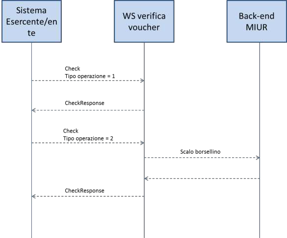

cartadeldocente.istruzione.it
=============================

**Servizio Web per verifica buono di spesa degli esercenti/ enti di formazione**

Gli esercenti o gli enti di formazione registrati al servizio cartadeldocente.istruzione.it per la vendita online potranno validare nei propri sistemi i buoni di spesa di beni o servizi da parte dei docenti utilizzando un servizio web di cui si forniscono di seguito le specifiche di utilizzo.

Il servizio web di **verifica del buono** da parte degli esercenti o degli enti di formazione rende disponibili 2 principali operazioni (“**Check**\ ” e “\ **Confirm**\ ”). La seguente descrizione delle operazioni è necessaria per valorizzare adeguatamente i campi di input. Pertanto le operazioni esposte dall’interfaccia wsdl possono essere descritte come segue:

1. **Check**

+---------+------------------------------+-----------------------------+
| INPUT:  | tipo operazione              | *“1”, “2”*                  |
+=========+==============================+=============================+
|         | codice buono                 |                             |
+---------+------------------------------+-----------------------------+
| OUTPUT: | nominativo beneficiario      | *CF o Nome e Cognome*       |
+---------+------------------------------+-----------------------------+
|         | partita IVA esercente ambito | *cinema, teatro, libreria…* |
+---------+------------------------------+-----------------------------+
|         | bene                         | *libri, spettacoli…*        |
+---------+------------------------------+-----------------------------+
|         | importo                      | *importo totale del buono*  |
+---------+------------------------------+-----------------------------+

Se **tipo operazione** verrà valorizzato con **“1”**, il check del buono restituerà all’esercente i campi previsti in output senza consumare il buono e quindi senza scalare l’importo dal Portafoglio del beneficiario. Questa modalità di utilizzo dell’operazione non è obbligatoria, ma lascia all’esercente la possibilità di eseguire un controllo tra il nominativo del beneficiario e quello del suo cliente in sessione.

Se **tipo operazione** verrà valorizzato con **“2”**, il check del buono consumerà direttamente l’importo, scalandolo dal Portafoglio del beneficiario, e restituerà comunque le informazioni previste in output. L’esercente potrà scegliere di usare direttamente questa modalità oppure effettuare due chiamate successive: la prima per il controllo del beneficiario e la seconda per l’effettivo utilizzo del buono.

Il sequence diagram seguente descrive ad alto livello l’interazione tra i vari sistemi coinvolti, nei casi fin qui descritti:

|image0|

Per poter sbloccare il buono ed utilizzarne tutto l’importo o solo parte di esso, l’esercente dovrà invocare l’operazione di **Confirm** di seguito descritta.

2. **Confirm**

INPUT: tipo operazione *“1”*

codice buono

importo *importo confermato dall’esercente*

OUTPUT: esito

In questa versione del servizio il **tipo operazione** verrà valorizzato sempre con **“1”** e l’esercente o l’ ente di formazione potrà comunicare la quota utilizzata rispetto all’importo totale del buono, momentaneamente impegnato. Il sistema scalerà l’importo dal Portafoglio del beneficiario, riaccreditando la parte non utilizzata, calcolata come differenza tra il valore totale del buono e l’importo comunicato dall’esercente.

L’\ **esito** dell’operazione (**“OK”** / **“KO”**) sarà restituito all’esercente o all’ ente di formazione che potrà eventualmente fornire un feedback al beneficiario.

