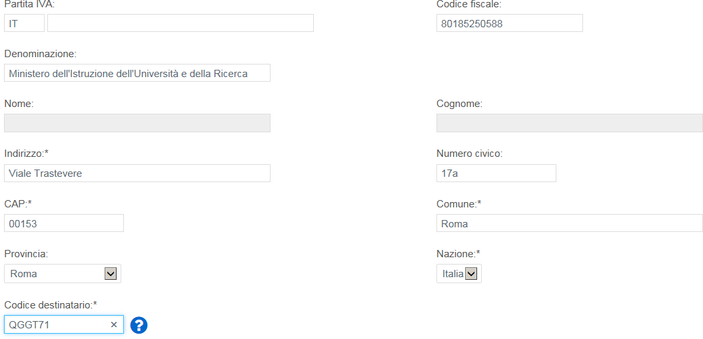
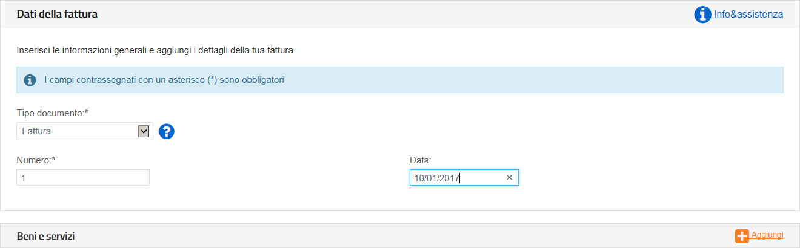
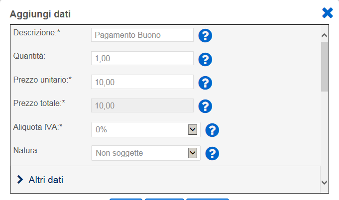
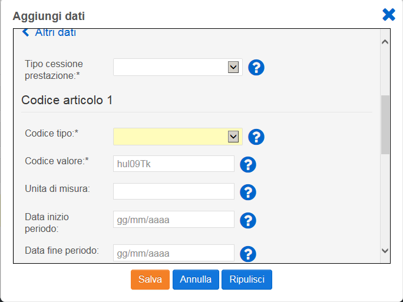
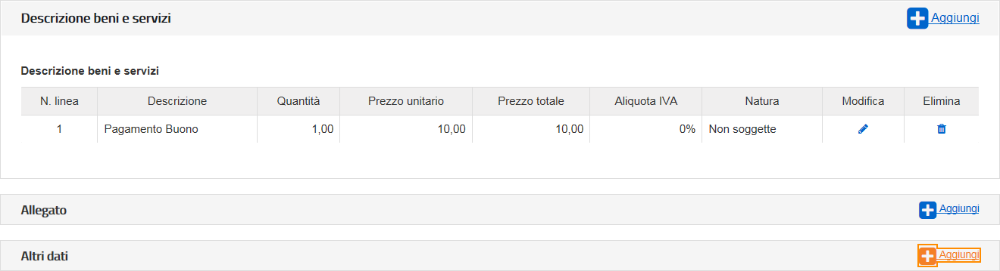
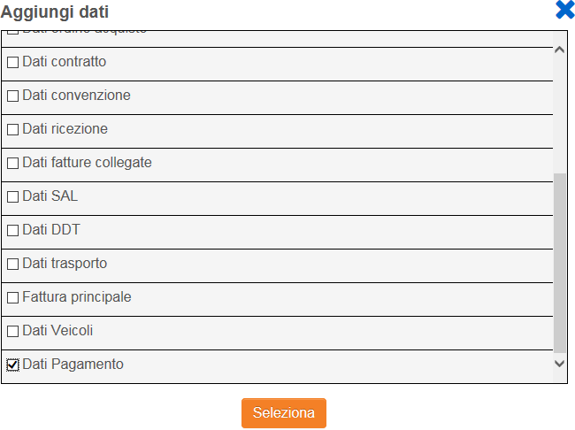
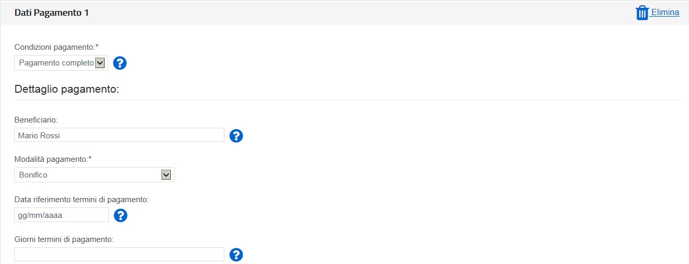

.. _passo-2:

Passo 2
=======

**CLIENTE** (Inserire i dati della pubblica amministrazione nei confronti della quale si emette la fattura)

I. .. _valorizzare-i-campi-come-descritto-di-seguito-dati-reali:

   .. rubric:: Valorizzare i campi come descritto di seguito (dati reali)
      :name: valorizzare-i-campi-come-descritto-di-seguito-dati-reali

   -  Codice Fiscale: 80185250588

   -  Denominazione: Ministero dell'Istruzione dell'Università e della Ricerca

   -  Indirizzo: Viale Trastevere

   -  Numero Civico: 76a

o Cap: 00153

-  Comune: Roma

-  Provincia: RM

-  Nazione: IT

-  Codice Destinatario: QGGT71

|image0|

.. _quindi-cliccare-su-vai-a-dati-fattura:

Quindi cliccare su >Vai a Dati Fattura
--------------------------------------

**Passo 3**

**DATI DELLA FATTURA** (Inserisci i dati della fattura)

I. .. _valorizzare-i-campi-come-descritto-di-seguito:

   .. rubric:: Valorizzare i campi come descritto di seguito
      :name: valorizzare-i-campi-come-descritto-di-seguito

   -  Tipo documento: Dal menù a tendina selezionare <Fattura>

   -  Numero: Numero che identifica univocamente la fattura

   -  Data: Inserire data

|image1|

II.  .. _nel-campo-beni-e-servizi-cliccare-su-aggiungi:

     .. rubric:: Nel campo Beni e Servizi cliccare su Aggiungi
        :name: nel-campo-beni-e-servizi-cliccare-su-aggiungi

III. **Valorizzare i campi come descritto di seguito**

     -  Descrizione: Pagamento Buono

     -  Quantità: 1

     -  Prezzo unitario: Inserire importo del singolo voucher es. 10,00

     -  Aliquota IVA: 0%

     -  |image2|\ Natura: Non soggette Quindi cliccare su >\ **Altri Dati**

IV.  .. _valorizzare-i-campi-come-descritto-di-seguito-1:

     .. rubric:: Valorizzare i campi come descritto di seguito
        :name: valorizzare-i-campi-come-descritto-di-seguito-1

     -  Codice Tipo: CARTADELDOCENTE

     -  Codice Valore: **Inserire esclusivamente il codice del buono (sensibile alla differenza tra caratteri maiuscoli e minuscoli) senza ulteriori valori (come riportato nella successiva immagine).**\ :sup:`1` **NB:**. Per prevenire il rischio di errore suggeriamo di inserire i codici dei buoni attraverso le funzionalità di copia/incolla direttamente dal portale.

.. _quindi-cliccare-su-salva:

Quindi cliccare su Salva
------------------------

|image3|

**È possibile inserire in fattura più di un buono cliccando di nuovo su <Aggiungi> nel Campo Beni e Servizi**

1 Campo obbligatorio al fine di ottenere il rimborso per la fattura. Attenzione: alcuni software potrebbero riportare campi nominati diversamente.

.. _nel-campo-altri-dati-cliccare-su-aggiungi-1:

.. _nel-campo-altri-dati-cliccare-su-aggiungi-1:

Nel campo Altri dati cliccare su Aggiungi
-----------------------------------------

|image4|

VI. **Spuntare "Dati di Pagamento" quindi cliccare su Seleziona**

|image5|

VII. **Inserire i dati relativi al pagamento come descritto di seguito:**

     -  Condizioni pagamento: Pagamento completo

     -  Beneficiario: Inserire il beneficiario es. Mario Rossi

     -  Modalità di pagamento: Bonifico

     -  Importo Pagamento: Inserire importo totale della fattura

     -  IBAN: Inserire IBAN es. IT0000000000000000\ :sup:`2`

|image6|

.. _quindi-cliccare-su-verifica-dati:

Quindi cliccare su >Verifica Dati
---------------------------------

2 **Attenzione**: L'omissione di IBAN o la sua errata compilazione non è segnalata come errore dal sistema. Accertarsi di averlo compilato correttamente prima di inviare la fattura.

