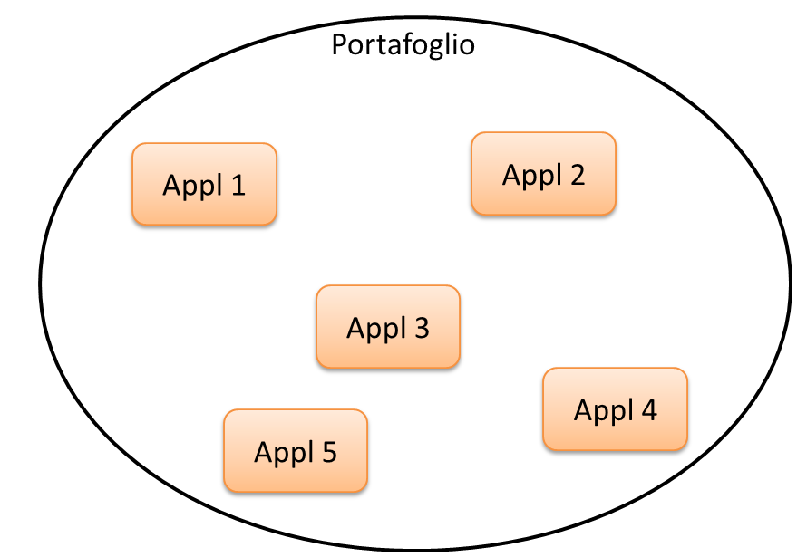
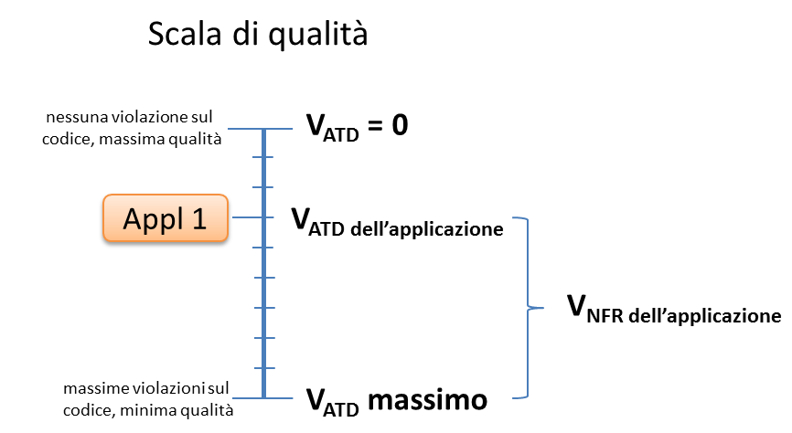

.. _assessment-di-parchi-applicativi-già-esistenti:

Assessment di parchi applicativi già esistenti
==============================================

*Descrizione*

Un'amministrazione dispone di un portafoglio applicativo costituito da software sviluppato per proprio conto, internamente o da fornitori esterni, nel corso di uno o più progetti. L'amministrazione intende valorizzare tale portafoglio applicativo, cioè valutarlo come asset, a scopo contabile ma anche per identificare aree di miglioramento per successivi interventi di manutenzione.

Si tratta di un caso piuttosto comune tra le P.A. italiane. Alcune amministrazioni centrali, ad esempio, dispongono di parchi applicativi molto ingenti, frutto di anni di investimenti, a volte di dimensioni e complessità tali da rischiare di perderne il controllo.

Peraltro, l'assessment del parco applicativo è un'attività propedeutica a interventi di razionalizzazione e di consolidamento dei sistemi informativi pubblici, che rappresentano noti obiettivi del Piano Triennale.

Per valorizzare il proprio portafoglio applicativo, l'amministrazione deve determinarne la dimensione. Riprendendo i concetti espressi al §3.4, per le applicazioni facenti parte del portafoglio occorre misurare le funzionalità erogate e le caratteristiche non funzionali.

*Soluzioni proposte (1)*

Come detto, il modo di procedere deve essere scelto in base al contesto. In presenza di documentazione insufficiente e/o obsoleta (ad esempio per parchi applicativi molto datati sviluppati su sistemi legacy), potrebbe essere meno oneroso l'uso di strumenti automatici (rif. §4.2.1): sfruttando tali strumenti l'amministrazione potrebbe ottenere una misura funzionale del parco applicativo, sommando le dimensioni funzionali delle singole applicazioni costituenti il parco.

Gli strumenti automatici potrebbero fornire anche una misura delle caratteristiche non funzionali delle singole applicazioni (ad esempio, con le metriche CISQ-OMG descritte al §4.6, si potrebbero misurare automaticamente le caratteristiche di affidabilità, sicurezza, manutenibilità e prestazione/efficienza). In alternativa o a complemento, potrebbero essere usate le metriche proposte dalla ISO 25023 e descritte al §4.4. Ove si desideri ottenere una misura complessiva di queste caratteristiche a livello di intero parco applicativo (es. per i già citati obiettivi di valorizzazione patrimoniale), si dovranno aggregare le misure eseguite sulle singole applicazioni. Per compiere quest'ultimo passo, si sconsiglia l'uso della media semplice o della mediana, ritenendo invece più efficace ricorrere alla media pesata.

Esempio pratico, estremamente semplificato per chiarezza di esposizione: supponiamo che un'amministrazione AMM1 possieda un portafoglio applicativo composto da 5 applicazioni (vedi figura). Si vuole valutare complessivamente questo portafoglio sulla base delle funzionalità erogate, dell'affidabilità e della manutenibilità.

|image0|

Si procederà misurando, per ciascuna applicazione:

-  la dimensione funzionale in PF;

-  l'affidabilità con una delle metriche di cui §4.4.3, oppure con uno strumento automatico di cui al §4.6;

-  la manutenibilità con una delle metriche di cui al §4.4.5, oppure uno strumento automatico di cui al §4.6.

Per riportare queste misure a livello di portafoglio complessivo, si procederà:

-  per la dimensione funzionale, sommando i PF delle singole applicazioni;

-  per le due caratteristiche non funzionali d'interesse (nel caso in esame, affidabilità e manutenibilità) ricorrendo a una media pesata, utilizzando come "peso" la dimensione funzionale, come nella tabella che segue, ove i valori numerici hanno meramente significato di esempio didattico.

Tabella 43: assessment del parco applicativo dell'amministrazione AMM1

+--------------------------+--------------------------------+----------------------------+------------------------------+
| **Applicazione**         | **Dimensione funzionale (PF)** | **Misura di affidabilità** | **Misura di manutenibilità** |
+==========================+================================+============================+==============================+
| Appl 1                   | 1.200                          | 1,4                        | 3,3                          |
+--------------------------+--------------------------------+----------------------------+------------------------------+
| Appl 2                   | 650                            | 2,2                        | 2,6                          |
+--------------------------+--------------------------------+----------------------------+------------------------------+
| Appl 3                   | 1.720                          | 1,7                        | 3                            |
+--------------------------+--------------------------------+----------------------------+------------------------------+
| Appl 4                   | 2.400                          | 3,6                        | 3,9                          |
+--------------------------+--------------------------------+----------------------------+------------------------------+
| Appl 5                   | 880                            | 0,9                        | 2                            |
+--------------------------+--------------------------------+----------------------------+------------------------------+
| Totale Parco Applicativo | 6.850                          | 2,26 [1]_                  | 3,20 [2]_                    |
+--------------------------+--------------------------------+----------------------------+------------------------------+

Si noti che i risultati del processo descritto potrebbero essere utilizzati anche per classificare, in base alla loro qualità, le applicazioni di un parco applicativo, oppure – in un'analisi di maggior dettaglio e granularità – per classificare i moduli software nell'ambito di una sezione specifica (es. contabilità, servizi del portale web) del portafoglio dell'amministrazione.

Riguardo all'ultimo passo necessario all'assessment, vale a dire la stima del valore in euro del parco applicativo, a oggi è relativamente facile, per la presenza di consolidati riferimenti di mercato, monetizzare la dimensione funzionale, moltiplicando il numero di PF per un corrispettivo unitario coerente con i riferimenti. Tornando all'esempio di tabella 43, ipotizzando un corrispettivo unitario di 200,00 euro al PF, il valore monetario della dimensione funzionale dell'amministrazione AMM1 è:

V\ :sub:`FUR` = 200,00 \* 6.850 = € 1.370.000,00

Purtroppo a oggi non si riscontra un'analoga disponibilità di riferimenti economici condivisi per quanto riguarda la dimensione non funzionale. Non è quindi immediato, almeno al momento, convertire i numeri delle ultime due celle di tabella 43 (in generale le misure non funzionali) in termini economici. In altre parole, non si può qui proporre una formula univoca per il calcolo del V\ :sub:`NFR` (valore della componente non funzionale).

Tra i vari strumenti e soluzioni presentate in questo documento, l'indicatore che sembra più vicino a questa tematica è l'Automated Technical Debt, citato al §4.6. Misurando il Technical Debt di un'applicazione si ottiene infatti una stima dell'impegno, espresso in giorni persona, necessario per eliminare i difetti nel codice dell'applicazione stessa. Moltiplicando la stima dell'impegno per una tariffa giornaliera coerente con i valori di mercato, si può riportare in euro la misura del Technical Debt.

Quest'ultima quantità (di seguito, per comodità, V\ :sub:`ATD`) si pone senz'altro in relazione inversa col V\ :sub:`NFR` dell'applicazione: nei casi in cui V\ :sub:`ATD` è nullo, V\ :sub:`NFR` è massimo. Bisogna tenere presente, tuttavia, che il Technical Debt non copre tutte le caratteristiche non funzionali: ad esempio l'usabilità rimane fuori dalla definizione di questo indicatore.

Nei soli casi in cui le caratteristiche funzionali che interessano siano tra quelle coperte dal Technical Debt (es. si sta valutando un portafoglio composto da applicazioni di tipo batch, pertanto l'usabilità non ha grande rilevanza), la dipendenza tra V\ :sub:`NFR` e V\ :sub:`ATD` è più stretta. In questi casi si può ritenere, come ordine di grandezza, che V\ :sub:`NFR` corrisponda alla differenza tra il valore massimo possibile per V\ :sub:`ATD` e il valore effettivo di V\ :sub:`ATD` misurato sull'applicazione in esame. Per maggiore chiarezza si veda la figura seguente.

|image1|

Con riferimento al Technical Debt, occorre precisare che la sua definizione e modalità di calcolo si basa su elaborazioni e dati di riferimento rilevati da CISQ-OMG nel periodo 2016-2017 nelle comunità di sviluppatori. Si tratta pertanto di uno strumento non necessariamente omogeneo con lo scenario della pubblica amministrazione italiana, e i cui risultati devono essere maneggiati con cautela.

Sarebbe auspicabile che una simile raccolta di dati progettuali (misure a consuntivo, stime, costi e impegni) fosse condotta anche nel settore pubblico, costituendo magari un repository centralizzato da cui trarre statistiche significative. La disponibilità di un tale repository consentirebbe non solo un confronto omogeneo tra le iniziative della PA, ma in prospettiva fornirebbe riferimenti economici di cui, come detto, oggi non c'è disponibilità. Su questa ipotesi, che per comodità chiameremo RPP (repository di progetti pubblici) torneremo in seguito.

*Soluzioni proposte (2)*

Come seconda soluzione, applicabile a casi ove la documentazione sia di buon livello e sufficiente alle necessità di un conteggio formale, si potrebbe misurare in PF la dimensione funzionale delle applicazioni che costituiscono il portafoglio e integrare tale conteggio con SNAP (metodo che, come detto, tiene conto delle caratteristiche non funzionali di un'applicazione). In questo caso la dimensione complessiva del portafoglio applicativo si ricondurrebbe a due numeri, rispettivamente:

-  la somma dei PF delle singole applicazioni costituenti il portafoglio;

-  la somma degli SP (SNAP Point) delle singole applicazioni costituenti il portafoglio.

Il metodo SNAP consente infatti di sommare tra loro i punti ottenuti sui diversi elementi previsti dal metodo, correlati alle caratteristiche non funzionali. Ciò può costituire un vantaggio ove obiettivo dell'assessment sia appunto ottenere una valutazione unica e complessiva del portafoglio applicativo. Viceversa, se l'amministrazione ritiene rilevanti solo alcune delle caratteristiche non funzionali (ad esempio la sola sicurezza, oppure la sicurezza e la manutenibilità), si potrebbe pensare a un uso parziale del metodo, conteggiando solo alcune categorie o sotto-categorie previste da SNAP.

Anche questa soluzione, tuttavia, risente delle medesime incertezze della precedente riguardo alla monetizzazione finale della misura, in quanto non sono a oggi disponibili riferimenti condivisi su un "valore di mercato" dello SNAP Point.

*Soluzioni proposte (3)*

Un'ulteriore soluzione, da suggerire alle amministrazioni prive di competenze interne sull'argomento e che dunque ritengono preferibile acquisire il servizio di assessment da fornitori esterni, consiste nel bandire una gara descrivendo l'esigenza ma lasciando al fornitore l'onere di formulare una proposta tecnica, che verrà poi valutata anche sotto l'aspetto metodologico.

Ove, come soluzione intermedia, l'amministrazione volesse solo reperire sul mercato risorse professionali con competenza sul tema delle misurazioni, potrebbe lanciare sul MEPA una RdO per servizi professionali. Giacché nelle RdO si possono precisare i servizi richiesti, integrando la documentazione di base con ulteriori note operative, si potrebbero inserire come requisiti indicazioni tratte dalla presente guida tecnica.

Come considerazione conclusiva, si evidenzia che tutte le soluzioni proposte in questo paragrafo prevedono un investimento, più o meno significativo, da parte dell'amministrazione. Benché tutte le P.A., in teoria, potrebbero essere interessate a condurre iniziative di assessment del loro parco applicativo, non è detto che tali iniziative si rivelino profittevoli, in un'ottica di costi-benefici, per ogni singola amministrazione, specie per le più piccole.

Per questi motivi, e tenendo presente i vantaggi complessivi a livello di sistema paese, potrebbe essere utile la costituzione, nell'ambito dei progetti strategici per la digitalizzazione, di un laboratorio centralizzato per la misurazione del software pubblico, gestito dall'AgID nel suo ruolo di soggetto responsabile dell'attuazione del PT.

Questo laboratorio potrebbe dotarsi delle competenze e degli strumenti necessari a supportare le amministrazioni nell'assessment del loro portafoglio applicativo. Ciò comporterebbe risparmi economici, messa a fattor comune di esperienze e soluzioni, omogeneità di metodi e misure e dunque confrontabilità tra le stesse.

Nello specifico, il laboratorio centralizzato potrebbe occuparsi della realizzazione e del mantenimento del repository di progetti pubblici (RPP) su citato. Inoltre, con riferimento agli strumenti automatici di cui al §4.6, il laboratorio centralizzato potrebbe acquisire una licenza di tipo enterprise (tale cioè da coprire le esigenze dell'intera P.A.) di eventuali prodotti proprietari, o meglio ancora potrebbe adattare e far evolvere, creando un'apposita community, un prodotto open source che implementi le specifiche CISQ-OMG, rendendolo così di uso gratuito per le amministrazioni.

.. [1]
    (1.200 \* 1,4 + 650 \* 2,2 + 1.720 \* 1,7 + 2.400 \* 3,6 + 880 \* 0,9) / 6850 = 2,26

.. [2]
    (1.200 \* 3,3 + 650 \* 2,6 + 1.720 \* 3 + 2.400 \* 3,9 + 880 \* 2) / 6850 = 3,20

