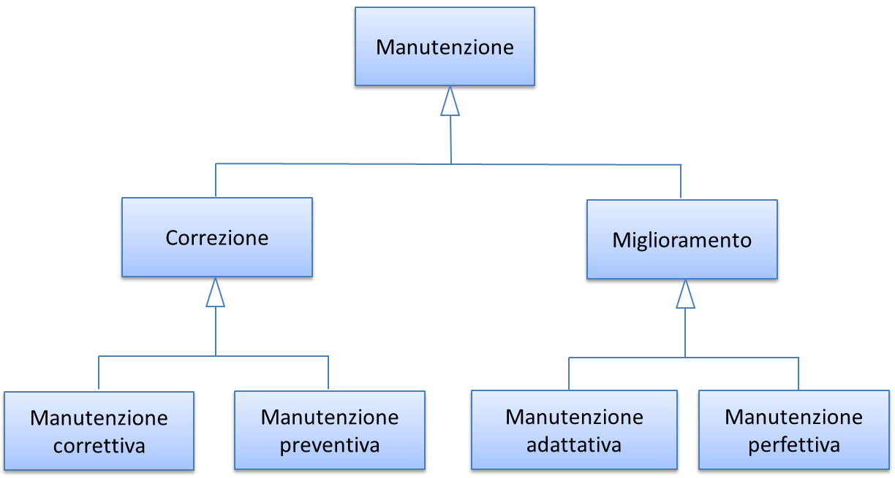

.. _manutenzione:

Manutenzione 
=============

Preliminarmente sembra utile classificare le varie tipologie di manutenzione – non evolutiva - che possono svolgersi sul software applicativo. Con riferimento alla norma ISO/IEC 14764:2006, si distinguono le seguenti tipologie:

-  manutenzione correttiva, che consiste nella modifica del software, eseguita dopo il rilascio [1]_, per correggere problemi rilevati;

-  manutenzione preventiva, vale a dire la modifica del software per correggere difetti prima che divengano problemi effettivi;

-  manutenzione adattativa, modifica del software per mantenerlo utilizzabile a fronte di cambiamenti dell'ambiente operativo;

-  manutenzione perfettiva, modifica del software per aumentarne la qualità (es. prestazioni, manutenibilità).

Le prime due tipologie comportano correzioni del software, la terza e la quarta miglioramenti.

Il diagramma E-R che segue illustra la gerarchia tra le tipologie di manutenzione su descritte.

|image0|

Figura 4: tipologie di manutenzione

.. _manutenzione-correttiva:

Manutenzione correttiva
-----------------------

Il servizio di manutenzione correttiva viene in genere acquisito dalle amministrazioni tramite contratti pluriennali che prevedono un pagamento a canone. L'importo del canone è legato alla dimensione funzionale del parco applicativo oggetto del servizio, con formule del tipo:

*F1: Canone_annuo = corrispettivo_unitario \* Dimensione*

in cui la dimensione è misurata in genere in PF.

Nei contratti normalmente stipulati nel settore pubblico, il corrispettivo unitario è un valore di mercato, nel senso che viene determinato da una negoziazione con il fornitore o viene offerto da quest'ultimo in gara.

Si ritiene che l'attuale situazione possa essere resa più efficiente ove l'amministrazione disponesse, per le applicazioni oggetto del servizio, di una misura della manutenibilità e dell'affidabilità (in particolare della sottocaratteristica "maturità"). Applicazioni di alta manutenibilità e maturità, in teoria, dovrebbero infatti richiedere meno interventi di manutenzione rispetto ad applicazioni di bassa manutenibilità e minore maturità. Ciò dovrebbe tradursi in un canone minore nel primo caso e più alto nel secondo.

Disponendo di tali misure, l'amministrazione potrebbe modulare il corrispettivo unitario della formula F1, tenendo presente la proporzionalità inversa su descritta. Peraltro, in situazioni ove il parco applicativo oggetto di manutenzione sia disomogeneo rispetto alla manutenibilità e alla maturità, si potrebbe utilizzare, per la determinazione del canone annuo, più corrispettivi unitari diversi.

Esempio: un'amministrazione deve acquisire un servizio di manutenzione su un parco software composto da due gruppi di applicazioni, GA1 e GA2. Il primo gruppo è caratterizzato da buona manutenibilità e alta maturità; il secondo gruppo invece ha bassa maturità (ad esempio è stato rilasciato più di recente) ed è scarsamente manutenibile. In questo caso l'amministrazione dovrebbe fissare un corrispettivo unitario CU1 basso da applicare al primo gruppo (a mero titolo di esempio, e per fornire un ordine di grandezza, diciamo 10 €/PF annui), e un CU2 alto per il secondo (sempre a titolo esemplificativo, diciamo 20 €/PF annui). Per semplicità operativa si potrebbe mantenere un unico canone complessivo (gestire separatamente, a livello contrattuale, gli interventi sui due gruppi sarebbe troppo oneroso) calcolato come segue:

Canone_annuo = CU1 \* PF1 + CU2 \* PF2

in cui PF1 è la dimensione funzionale del primo gruppo di applicazione, mentre PF2 è la dimensione funzionale del secondo gruppo. Si noti che, ove l'amministrazione non disponesse delle misure funzionali PF1 e PF2, e il livello della documentazione rendesse problematico un conteggio manuale dei punti funzione, potrebbe ricorrere agli strumenti automatici di cui al §4.2.1. Ammettendo, come ipotesi esemplificativa, che il conteggio (manuale o automatico) avesse fornito come risultato i valori PF1 = 1.400 e PF2 = 850, applicando la formula di cui sopra si determinerebbe un canone annuo complessivo pari a: 10 \* 1.400 + 20 \* 850 = 31.000,00 euro.

Come ultima indicazione, occorre considerare che la maturità del software dipende non solo da quando lo stesso è entrato in esercizio, ma anche dagli interventi di manutenzione che esso ha subito dal momento del rilascio. Ciò si riscontra ad esempio nella definizione delle metriche di maturità del §4.4.3.1. L'amministrazione deve tenerne conto, ripetendo la misura di questa sottocaratteristica al termine di un contratto di manutenzione, anche allo scopo di definire il canone di un eventuale contratto successivo.

.. _manutenzione-preventiva:

Manutenzione preventiva
-----------------------

Il servizio di manutenzione preventiva, ove previsto, è in generale acquisito dalle amministrazioni nell'ambito dei medesimi contratti per la manutenzione correttiva. Valgono quindi le indicazioni del paragrafo precedente. Si riscontrano anche casi in cui il servizio non è incluso nel contratto, oppure è descritto in maniera tale da renderlo inefficace: ad esempio vengono previsti SLA e penali che si riferiscono alla sola manutenzione correttiva (tempi di intervento a seguito di segnalazione, tempi di ripristino).

Per migliorare la situazione si suggerisce l'impiego di metriche per l'affidabilità (sottocaratteristiche "maturità" e "disponibilità"). Ad esempio, l'amministrazione potrebbe misurare queste sottocaratteristiche all'inizio del contratto e fissare come SLA che, grazie agli interventi di manutenzione preventiva, esse debbano migliorare, in un intervallo di tempo fissato, di una certa percentuale. Il mancato rispetto di questo SLA potrebbe comportare l'applicazione di una penale; al contrario, ove si riscontri un miglioramento superiore alla soglia minima, ciò potrebbe determinare il pagamento di una quota sospesa dell'importo dovuto al fornitore.

Si noti che, a differenza del paragrafo precedente ove le misure erano di uso "interno" all'amministrazione, i suggerimenti qui espressi richiedono metriche oggettive, soprattutto per evitare contenziosi con il fornitore sul rispetto degli SLA e l'applicazione delle penali. Sono pertanto da evitare misure che includono un certo grado di soggettività (vedi gli esempi del §2.4.1): potrebbe invece essere opportuno l'impiego delle metriche ISO di cui al §4.4.3.1 e al §4.4.3.2, o di strumenti di misura automatica.

Gli strumenti di misura automatici potrebbero essere impiegati anche per verificare che un intervento di manutenzione correttiva o preventiva non abbia peggiorato le caratteristiche di qualità dell'applicazione oggetto dell'intervento stesso (ciò potrebbe avvenire se la correzione viene eseguita non rispettando le regole di corretta programmazione, vale a dire eliminando l'errore ma ad esempio abbassando il livello di manutenibilità o di sicurezza dell'applicazione).

Operativamente, ciò si ottiene effettuando i seguenti passi:

1) si misura, alla stipula del contratto o all'attivazione del servizio di manutenzione, le caratteristiche di qualità del software oggetto del servizio;

2) si ripete con cadenza periodica, ad esempio trimestralmente, le suddette misure;

3) si verifica che le caratteristiche di qualità misurate non si siano abbassate nel tempo. Ogni variazione peggiorativa porterà all'applicazione di una penale al fornitore, ad esempio pari alla variazione in aumento dell'Automated Technical Debt.

Occorre ovviamente esplicitare nel contratto gli elenchi o i riferimenti alle regole di corretta programmazione su cui si basano le misurazioni automatiche, in modo da evitare contestazioni da parte del fornitore (in caso contrario, il fornitore si troverebbe costretto a utilizzare lo stesso strumento automatico di misura).

Anche per il servizio di manutenzione, ove l'amministrazione non abbia competenze e/o esperienza sulle metriche, potrebbe richiedere allo stesso fornitore di descrivere, nella sua proposta tecnica, gli strumenti e/o la soluzione che userà per effettuare le misurazioni suggerite in questo paragrafo, e assegnare parte del punteggio tecnico di gara all'efficacia della soluzione proposta.

Qualunque sia il percorso che porta alla scelta dello strumento/soluzione, quest'ultimo dovrà essere chiaramente indicato nel contratto, esplicitandone metodologia d'uso, ruoli e responsabilità per evitare contenziosi durante l'erogazione del servizio.

.. _manutenzione-adattativa:

Manutenzione adattativa
-----------------------

Nei tipici contratti pubblici gli interventi di manutenzione adattativa sono considerati attività progettuali e remunerati a tempo e spesa (sulla base dei giorni persona erogati e rendicontati) oppure a corpo, sulla base di una stima iniziale proposta dal fornitore e accettata dall'amministrazione cliente.

Ribadendo le considerazioni espresse al §4.1, si ritiene che anche per questa tipologia di servizio sarebbe conveniente e meno rischiosa una modalità di remunerazione a misura.

Dal punto di vista teorico e in termini ISO (vedi §3.1.3), qualunque intervento di manutenzione adattativa migliora la caratteristica "portabilità", in particolare le sottocaratteristiche "adattabilità" e "installabilità". Pertanto, si potrebbe valutare quantitativamente l'intervento misurando il valore di tali sottocaratteristiche prima e dopo l'intervento stesso. In analogia a quanto proposto al paragrafo precedente, si potrebbe definire, come SLA, che grazie all'intervento di manutenzione adattativo richiesto tali sottocaratteristiche debbano migliorare di una certa percentuale. Il mancato rispetto dello SLA potrebbe comportare l'applicazione di una penale; al contrario, ove si riscontri un miglioramento superiore alla soglia minima, ciò potrebbe determinare il pagamento di una quota sospesa dell'importo dovuto al fornitore. Questa modalità di pagamento consentirebbe di considerare gli interventi di manutenzione adattativa come investimenti, imputando il loro importo come CAPEX invece che come OPEX.

Anche nel caso della manutenzione adattativa, la necessità di definire SLA e penali sconsiglia l'uso di metriche soggettive, e suggerisce invece strumenti automatici o comunque misure di tipo oggettivo.

Tra le metriche illustrate nei capitoli precedenti, si potrebbero adoperare:

-  la sottocategoria SNAP 3.1: "multiple platforms";

-  le metriche ISO 25023 di cui al §4.4.7.

Resta il suggerimento, per le amministrazioni prive di competenze ed esperienze in materia, di chiedere allo stesso fornitore di descrivere, nella sua proposta tecnica, gli strumenti e/o la soluzione che userà per effettuare le misurazioni di cui sopra, e assegnare parte del punteggio tecnico di gara alla soluzione proposta.

Anche per la manutenzione adattativa, è possibile l'uso di strumenti automatici per verificare il rispetto delle regole di corretta programmazione e il conseguente mantenimento del livello di qualità del software oggetto dell'intervento (vedi paragrafo precedente).

.. _manutenzione-perfettiva:

Manutenzione perfettiva
-----------------------

Nei contratti delle P.A. gli interventi di manutenzione perfettiva sono in genere considerati attività progettuali, remunerati a tempo e spesa (sulla base dei giorni persona erogati e rendicontati) oppure a corpo, sulla base di una stima iniziale proposta dal fornitore e accettata dall'amministrazione cliente.

Ribadendo le considerazioni espresse al §4.1, si ritiene che anche per questa tipologia sarebbe conveniente e meno rischiosa una modalità di remunerazione a misura.

Dal punto di vista teorico e in termini ISO (vedi §3.1.3), la manutenzione perfettiva può impattare su una o più caratteristiche non funzionali dell'applicazione oggetto dell'intervento. Si può ad esempio voler migliorare le prestazioni, l'usabilità o la manutenibilità dell'applicazione in oggetto. Pertanto si potrebbe valutare quantitativamente l'intervento misurando il valore di tali caratteristiche prima e dopo l'intervento stesso. Si tratta, a ben vedere, di una generalizzazione rispetto al caso del paragrafo precedente, in cui l'unica caratteristica impattata era la portabilità. Per chiarire quanto detto, si riportano di seguito alcune situazioni tipiche, volutamente semplificate per fungere da esempio.

.. _caso-1-incremento-di-prestazioni:

Caso 1: incremento di prestazioni
~~~~~~~~~~~~~~~~~~~~~~~~~~~~~~~~~

Una P.A. richiede un intervento di manutenzione per migliorare i tempi di risposta di un'applicazione. L'intervento non prevede sviluppo, modifica o cancellazione di funzionalità.

Come primo passo, l'amministrazione dovrà precisare i contenuti dell'intervento redigendo in termini quantitativi i requisiti di prestazione richiesti. A tale scopo potrebbero essere utili le metriche illustrate al §4.4.1.1.

L'amministrazione, inoltre, dovrà esplicitare il contesto in cui l'applicazione opera (piattaforma, risorse, eventuali middleware) e misurare, con le stesse metriche con cui ha espresso i requisiti, le prestazioni prima dell'intervento.

La differenza tra quest'ultima misura e il requisito espresso costituirà l'indicatore di risultato dell'intervento. Essa potrà servire come SLA, per l'imputazione di eventuali penali o il pagamento di quote sospese. Al fine di evitare contenziosi con il fornitore, si dovranno esplicitare nel contratto le modalità di misura, i ruoli e le responsabilità spettanti ai contraenti.

Giacché l'intervento aumenta una caratteristica di qualità dell'applicazione, e dunque il suo valore, esso potrà senz'altro essere considerato come investimento, e contabilizzato di conseguenza come CAPEX.

Anche in questo caso può essere d'interesse per l'amministrazione assicurarsi che l'intervento non abbia peggiorato altre caratteristiche dell'applicazione. Ciò potrebbe essere verificato con strumenti automatici (vedi paragrafi precedenti).

.. _caso-2-intervento-sullaccessibilità:

Caso 2: intervento sull'accessibilità
~~~~~~~~~~~~~~~~~~~~~~~~~~~~~~~~~~~~~

Una P.A. richiede un intervento di manutenzione che, senza modificare, sviluppare o cancellare funzionalità, renda un'applicazione conforme alla normativa sull'accessibilità (che è una sottocaratteristica dell'usabilità, vedi §4.4.2).

Una prima soluzione per valutare quantitativamente l'intervento, in termini di risultato, può derivare dall'esempio del §2.4.1.2. Qui di seguito si riporta la tabella che, per i 12 requisiti di accessibilità stabiliti dalla normativa, contengono gli elementi di conformità da verificare.

Tabella 45: checklist per accessibilità

+-----------------------------------------------------------------------------------------------------------------------------------------------------------------------------------------------------------------------------------------------------------------------------------------------------------------------------------------------------------------------------------------------------------+--------------------------------------------------------------------------------------------------+------------------------------------------------------------------------------------------------------------------------------------------------------------------------------------------------------------------------------------------------------------------------------------------------------------------------+--------------+
| **Descrizione del requisito**                                                                                                                                                                                                                                                                                                                                                                             | **Punto di controllo**                                                                           | **Descrizione degli elementi del punto di controllo**                                                                                                                                                                                                                                                                  | **Conformità |
|                                                                                                                                                                                                                                                                                                                                                                                                           |                                                                                                  |                                                                                                                                                                                                                                                                                                                        | (S/N/NA)**   |
+===========================================================================================================================================================================================================================================================================================================================================================================================================+==================================================================================================+========================================================================================================================================================================================================================================================================================================================+==============+
| Req1 - Alternative testuali: fornire alternative testuali per qualsiasi contenuto di natura non testuale in modo che il testo predisposto come alternativa possa essere fruito e trasformato secondo le necessità degli utenti, come per esempio convertito in stampa a caratteri ingranditi, in stampa Braille, letto da una sintesi vocale, simboli o altra modalità di rappresentazione del contenuto. | 1.1 – Contenuti non testuali                                                                     | Tutti i contenuti non testuali presentano un'alternativa testuale equivalente.                                                                                                                                                                                                                                         |              |
+-----------------------------------------------------------------------------------------------------------------------------------------------------------------------------------------------------------------------------------------------------------------------------------------------------------------------------------------------------------------------------------------------------------+--------------------------------------------------------------------------------------------------+------------------------------------------------------------------------------------------------------------------------------------------------------------------------------------------------------------------------------------------------------------------------------------------------------------------------+--------------+
|                                                                                                                                                                                                                                                                                                                                                                                                           |                                                                                                  | I controlli e gli elementi che raccolgono l'input dell'utente possiedono un nome esplicativo che ne descrive la finalità.                                                                                                                                                                                              |              |
+-----------------------------------------------------------------------------------------------------------------------------------------------------------------------------------------------------------------------------------------------------------------------------------------------------------------------------------------------------------------------------------------------------------+--------------------------------------------------------------------------------------------------+------------------------------------------------------------------------------------------------------------------------------------------------------------------------------------------------------------------------------------------------------------------------------------------------------------------------+--------------+
|                                                                                                                                                                                                                                                                                                                                                                                                           |                                                                                                  | In presenza di audio, video, animazioni, è stata fornita un'alternativa testuale che ne contiene la descrizione sintetica.                                                                                                                                                                                             |              |
+-----------------------------------------------------------------------------------------------------------------------------------------------------------------------------------------------------------------------------------------------------------------------------------------------------------------------------------------------------------------------------------------------------------+--------------------------------------------------------------------------------------------------+------------------------------------------------------------------------------------------------------------------------------------------------------------------------------------------------------------------------------------------------------------------------------------------------------------------------+--------------+
|                                                                                                                                                                                                                                                                                                                                                                                                           |                                                                                                  | Test ed esercizi che non possono essere compresi se presentati in versione testuale sono comunque corredati di una breve descrizione che ne specifichi il contenuto.                                                                                                                                                   |              |
+-----------------------------------------------------------------------------------------------------------------------------------------------------------------------------------------------------------------------------------------------------------------------------------------------------------------------------------------------------------------------------------------------------------+--------------------------------------------------------------------------------------------------+------------------------------------------------------------------------------------------------------------------------------------------------------------------------------------------------------------------------------------------------------------------------------------------------------------------------+--------------+
|                                                                                                                                                                                                                                                                                                                                                                                                           |                                                                                                  | I contenuti non testuali che rappresentino specifiche esperienze sensoriali sono corredati di didascalie sintetiche che ne identifichino chiaramente lo scopo.                                                                                                                                                         |              |
+-----------------------------------------------------------------------------------------------------------------------------------------------------------------------------------------------------------------------------------------------------------------------------------------------------------------------------------------------------------------------------------------------------------+--------------------------------------------------------------------------------------------------+------------------------------------------------------------------------------------------------------------------------------------------------------------------------------------------------------------------------------------------------------------------------------------------------------------------------+--------------+
|                                                                                                                                                                                                                                                                                                                                                                                                           |                                                                                                  | I CAPTCHA sono muniti di alternative testuali commisurate alle diverse tipologie di disabilità (captcha audio, captcha visivo, captcha semantico).                                                                                                                                                                     |              |
+-----------------------------------------------------------------------------------------------------------------------------------------------------------------------------------------------------------------------------------------------------------------------------------------------------------------------------------------------------------------------------------------------------------+--------------------------------------------------------------------------------------------------+------------------------------------------------------------------------------------------------------------------------------------------------------------------------------------------------------------------------------------------------------------------------------------------------------------------------+--------------+
|                                                                                                                                                                                                                                                                                                                                                                                                           |                                                                                                  | I contenuti non testuali che rappresentino decorazioni, formattazioni, elementi invisibili, sono costruiti in modo tale da poter essere ignorati dalle tecnologie assistive.                                                                                                                                           |              |
+-----------------------------------------------------------------------------------------------------------------------------------------------------------------------------------------------------------------------------------------------------------------------------------------------------------------------------------------------------------------------------------------------------------+--------------------------------------------------------------------------------------------------+------------------------------------------------------------------------------------------------------------------------------------------------------------------------------------------------------------------------------------------------------------------------------------------------------------------------+--------------+
| Req2 - Contenuti audio, contenuti video, animazioni: fornire alternative testuali equivalenti per le informazioni veicolate da formati audio, formati video, formati contenenti immagini animate (animazioni), formati multisensoriali in genere.                                                                                                                                                         | 2.1 – Contenuti registrati presentati in formato solo audio, solo video o animazione senza audio | I contenuti multimediali (solo audio, solo video o animazione senza audio) che non rappresentino un'alternativa ad un contenuto testuale già esistente nel sito ed etichettato come tale, sono corredati della relativa alternativa testuale equivalente.                                                              |              |
+-----------------------------------------------------------------------------------------------------------------------------------------------------------------------------------------------------------------------------------------------------------------------------------------------------------------------------------------------------------------------------------------------------------+--------------------------------------------------------------------------------------------------+------------------------------------------------------------------------------------------------------------------------------------------------------------------------------------------------------------------------------------------------------------------------------------------------------------------------+--------------+
|                                                                                                                                                                                                                                                                                                                                                                                                           | 2.2 - Sottotitoli (per contenuti registrati)                                                     | I contenuti multisensoriali (video con audio, animazione con audio) che non rappresentino un'alternativa ad un contenuto testuale già esistente nel sito ed etichettato come tale, sono corredati di sottotitoli sincronizzati.                                                                                        |              |
+-----------------------------------------------------------------------------------------------------------------------------------------------------------------------------------------------------------------------------------------------------------------------------------------------------------------------------------------------------------------------------------------------------------+--------------------------------------------------------------------------------------------------+------------------------------------------------------------------------------------------------------------------------------------------------------------------------------------------------------------------------------------------------------------------------------------------------------------------------+--------------+
|                                                                                                                                                                                                                                                                                                                                                                                                           | 2.3 – Audio – descrizioni o trascrizioni descrittive (per contenuti registrati)                  | I contenuti registrati in formato video o animazioni che contengano informazioni o azioni necessarie all'erogazione di un servizio e non rappresentino un'alternativa ad un contenuto testuale già esistente nel sito ed etichettato come tale, sono corredati di descrizione alternativa in formato audio o testuale. |              |
+-----------------------------------------------------------------------------------------------------------------------------------------------------------------------------------------------------------------------------------------------------------------------------------------------------------------------------------------------------------------------------------------------------------+--------------------------------------------------------------------------------------------------+------------------------------------------------------------------------------------------------------------------------------------------------------------------------------------------------------------------------------------------------------------------------------------------------------------------------+--------------+
|                                                                                                                                                                                                                                                                                                                                                                                                           | 2.4 – Sottotitoli (per contenuti in diretta)                                                     | I contenuti multimediali presentati in diretta, ritenuti essenziali per l'erogazione di un servizio sono corredati di sottotitoli sincronizzati.                                                                                                                                                                       |              |
+-----------------------------------------------------------------------------------------------------------------------------------------------------------------------------------------------------------------------------------------------------------------------------------------------------------------------------------------------------------------------------------------------------------+--------------------------------------------------------------------------------------------------+------------------------------------------------------------------------------------------------------------------------------------------------------------------------------------------------------------------------------------------------------------------------------------------------------------------------+--------------+
| Req3 - Adattabile: creare contenuti che possano essere presentati in modalità differenti (ad esempio, con layout più semplici), senza perdita di informazioni o struttura.                                                                                                                                                                                                                                | 3.1 – Informazioni e correlazioni                                                                | Informazioni, struttura e correlazione tra distinti blocchi di contenuto presentati nelle pagine sono fruibili in qualsiasi situazione in quanto definite tramite tecnologie compatibili con l'accessibilità o resi disponibili in formato testuale.                                                                   |              |
+-----------------------------------------------------------------------------------------------------------------------------------------------------------------------------------------------------------------------------------------------------------------------------------------------------------------------------------------------------------------------------------------------------------+--------------------------------------------------------------------------------------------------+------------------------------------------------------------------------------------------------------------------------------------------------------------------------------------------------------------------------------------------------------------------------------------------------------------------------+--------------+
|                                                                                                                                                                                                                                                                                                                                                                                                           | 3.2 – Sequenze significative                                                                     | La sequenza di lettura dei contenuti, laddove necessaria per la comprensione degli stessi, è stata correttamente definita tramite tecnologie compatibili con l'accessibilità.                                                                                                                                          |              |
+-----------------------------------------------------------------------------------------------------------------------------------------------------------------------------------------------------------------------------------------------------------------------------------------------------------------------------------------------------------------------------------------------------------+--------------------------------------------------------------------------------------------------+------------------------------------------------------------------------------------------------------------------------------------------------------------------------------------------------------------------------------------------------------------------------------------------------------------------------+--------------+
|                                                                                                                                                                                                                                                                                                                                                                                                           | 3.3 – Informazioni e correlazioni                                                                | Le istruzioni fornite per comprendere ed operare sui contenuti non si basano esclusivamente sulle caratteristiche sensoriali dei loro componenti (forma, dimensione, posizione, orientamento o suono).                                                                                                                 |              |
+-----------------------------------------------------------------------------------------------------------------------------------------------------------------------------------------------------------------------------------------------------------------------------------------------------------------------------------------------------------------------------------------------------------+--------------------------------------------------------------------------------------------------+------------------------------------------------------------------------------------------------------------------------------------------------------------------------------------------------------------------------------------------------------------------------------------------------------------------------+--------------+
| Req4 - Distinguibile: rendere più semplice agli utenti la visione e l'ascolto dei contenuti, separando i contenuti in primo piano dallo sfondo.                                                                                                                                                                                                                                                           | 4.1 – Uso del colore                                                                             | Il colore non è l'unica modalità utilizzata per rappresentare informazioni, indicare azioni, richiedere risposte o come elemento di distinzione visiva.                                                                                                                                                                |              |
+-----------------------------------------------------------------------------------------------------------------------------------------------------------------------------------------------------------------------------------------------------------------------------------------------------------------------------------------------------------------------------------------------------------+--------------------------------------------------------------------------------------------------+------------------------------------------------------------------------------------------------------------------------------------------------------------------------------------------------------------------------------------------------------------------------------------------------------------------------+--------------+
|                                                                                                                                                                                                                                                                                                                                                                                                           | 4.2 – Controllo del sonoro                                                                       | Sonoro: sono previste funzionalità di avvio, messa in pausa o interruzione. In alternativa è prevista una modalità del controllo del volume indipendente da quella predefinita dal sistema.                                                                                                                            |              |
+-----------------------------------------------------------------------------------------------------------------------------------------------------------------------------------------------------------------------------------------------------------------------------------------------------------------------------------------------------------------------------------------------------------+--------------------------------------------------------------------------------------------------+------------------------------------------------------------------------------------------------------------------------------------------------------------------------------------------------------------------------------------------------------------------------------------------------------------------------+--------------+
|                                                                                                                                                                                                                                                                                                                                                                                                           |                                                                                                  | L'audio avviato in automatico non dura più di tre secondi.                                                                                                                                                                                                                                                             |              |
+-----------------------------------------------------------------------------------------------------------------------------------------------------------------------------------------------------------------------------------------------------------------------------------------------------------------------------------------------------------------------------------------------------------+--------------------------------------------------------------------------------------------------+------------------------------------------------------------------------------------------------------------------------------------------------------------------------------------------------------------------------------------------------------------------------------------------------------------------------+--------------+
|                                                                                                                                                                                                                                                                                                                                                                                                           | 4.3 – Contrasto (minimo)                                                                         | I testi, compresi quelli rappresentati come immagine hanno un contrasto minimo tra primo piano e sfondo di almeno 4.5:1                                                                                                                                                                                                |              |
+-----------------------------------------------------------------------------------------------------------------------------------------------------------------------------------------------------------------------------------------------------------------------------------------------------------------------------------------------------------------------------------------------------------+--------------------------------------------------------------------------------------------------+------------------------------------------------------------------------------------------------------------------------------------------------------------------------------------------------------------------------------------------------------------------------------------------------------------------------+--------------+
|                                                                                                                                                                                                                                                                                                                                                                                                           |                                                                                                  | Testi di almeno 18 punti normale o 14 punti grassetto, ritenuti di grandi dimensioni, anche quando rappresentati come immagine, hanno un contrasto minimo di 3:1                                                                                                                                                       |              |
+-----------------------------------------------------------------------------------------------------------------------------------------------------------------------------------------------------------------------------------------------------------------------------------------------------------------------------------------------------------------------------------------------------------+--------------------------------------------------------------------------------------------------+------------------------------------------------------------------------------------------------------------------------------------------------------------------------------------------------------------------------------------------------------------------------------------------------------------------------+--------------+
|                                                                                                                                                                                                                                                                                                                                                                                                           | 4.4 – ridimensionamento del testo                                                                | I testi sono ridimensionabili fino al 200% senza l'ausilio di tecnologie assistive e senza che vi sia perdita di contenuti e funzionalità.                                                                                                                                                                             |              |
+-----------------------------------------------------------------------------------------------------------------------------------------------------------------------------------------------------------------------------------------------------------------------------------------------------------------------------------------------------------------------------------------------------------+--------------------------------------------------------------------------------------------------+------------------------------------------------------------------------------------------------------------------------------------------------------------------------------------------------------------------------------------------------------------------------------------------------------------------------+--------------+
|                                                                                                                                                                                                                                                                                                                                                                                                           | 4.5 – Testo rappresentato come immagine                                                          | Sono evitati testi sotto forma di immagine ad eccezione di immagini personalizzabili, logotipi e casi in cui una particolare rappresentazione di un testo sia ritenuta essenziale per il tipo di informazione veicolata.                                                                                               |              |
+-----------------------------------------------------------------------------------------------------------------------------------------------------------------------------------------------------------------------------------------------------------------------------------------------------------------------------------------------------------------------------------------------------------+--------------------------------------------------------------------------------------------------+------------------------------------------------------------------------------------------------------------------------------------------------------------------------------------------------------------------------------------------------------------------------------------------------------------------------+--------------+
| Req5 - Accessibile da tastiera: rendere disponibili tutte le funzionalità anche tramite tastiera.                                                                                                                                                                                                                                                                                                         | 5.1 – Tastiera                                                                                   | Tutte le funzionalità sono utilizzabili tramite tastiera senza che vi sia obbligo di tempi specifici per le singole battute.                                                                                                                                                                                           |              |
+-----------------------------------------------------------------------------------------------------------------------------------------------------------------------------------------------------------------------------------------------------------------------------------------------------------------------------------------------------------------------------------------------------------+--------------------------------------------------------------------------------------------------+------------------------------------------------------------------------------------------------------------------------------------------------------------------------------------------------------------------------------------------------------------------------------------------------------------------------+--------------+
|                                                                                                                                                                                                                                                                                                                                                                                                           |                                                                                                  | Le funzioni che richiedono un input dipendente dai movimenti dell'utente e che non possano essere ottenute in modo equivalente tramite input da tastiera sono utilizzabili tramite altre periferiche di input.                                                                                                         |              |
+-----------------------------------------------------------------------------------------------------------------------------------------------------------------------------------------------------------------------------------------------------------------------------------------------------------------------------------------------------------------------------------------------------------+--------------------------------------------------------------------------------------------------+------------------------------------------------------------------------------------------------------------------------------------------------------------------------------------------------------------------------------------------------------------------------------------------------------------------------+--------------+
|                                                                                                                                                                                                                                                                                                                                                                                                           | 5.2 – Nessun impedimento all'uso della tastiera                                                  | Tutti i componenti della pagina sono navigabili tramite tastiera.                                                                                                                                                                                                                                                      |              |
+-----------------------------------------------------------------------------------------------------------------------------------------------------------------------------------------------------------------------------------------------------------------------------------------------------------------------------------------------------------------------------------------------------------+--------------------------------------------------------------------------------------------------+------------------------------------------------------------------------------------------------------------------------------------------------------------------------------------------------------------------------------------------------------------------------------------------------------------------------+--------------+
|                                                                                                                                                                                                                                                                                                                                                                                                           |                                                                                                  | L'utente è in grado di gestire il focus dei componenti della pagina tramite tastiera                                                                                                                                                                                                                                   |              |
+-----------------------------------------------------------------------------------------------------------------------------------------------------------------------------------------------------------------------------------------------------------------------------------------------------------------------------------------------------------------------------------------------------------+--------------------------------------------------------------------------------------------------+------------------------------------------------------------------------------------------------------------------------------------------------------------------------------------------------------------------------------------------------------------------------------------------------------------------------+--------------+
|                                                                                                                                                                                                                                                                                                                                                                                                           |                                                                                                  | L'utente è informato esplicitamente sulle modalità di rilascio del focus quando non è sufficiente l'uso di normali tasti (freccia o tab).                                                                                                                                                                              |              |
+-----------------------------------------------------------------------------------------------------------------------------------------------------------------------------------------------------------------------------------------------------------------------------------------------------------------------------------------------------------------------------------------------------------+--------------------------------------------------------------------------------------------------+------------------------------------------------------------------------------------------------------------------------------------------------------------------------------------------------------------------------------------------------------------------------------------------------------------------------+--------------+
| Req6 - Adeguata disponibilità di tempo: fornire all'utente tempo sufficiente per leggere ed utilizzare i contenuti.                                                                                                                                                                                                                                                                                       | 6.1 – Regolazione tempi di esecuzione                                                            | Per i limiti di tempo inferiori a 20 ore, non essenziali per l'attività e che non riguardino eventi in tempo reale è soddisfatto almeno uno dei seguenti casi: (selezionare una delle seguenti opzioni)                                                                                                                |              |
+-----------------------------------------------------------------------------------------------------------------------------------------------------------------------------------------------------------------------------------------------------------------------------------------------------------------------------------------------------------------------------------------------------------+--------------------------------------------------------------------------------------------------+------------------------------------------------------------------------------------------------------------------------------------------------------------------------------------------------------------------------------------------------------------------------------------------------------------------------+--------------+
|                                                                                                                                                                                                                                                                                                                                                                                                           |                                                                                                  | L'utente può rimuovere il limite di tempo prima che esso sia raggiunto.                                                                                                                                                                                                                                                |              |
+-----------------------------------------------------------------------------------------------------------------------------------------------------------------------------------------------------------------------------------------------------------------------------------------------------------------------------------------------------------------------------------------------------------+--------------------------------------------------------------------------------------------------+------------------------------------------------------------------------------------------------------------------------------------------------------------------------------------------------------------------------------------------------------------------------------------------------------------------------+--------------+
|                                                                                                                                                                                                                                                                                                                                                                                                           |                                                                                                  | L'utente può regolare il limite di tempo prima che esso sia raggiunto estendendone la durata di almeno 10 volte.                                                                                                                                                                                                       |              |
+-----------------------------------------------------------------------------------------------------------------------------------------------------------------------------------------------------------------------------------------------------------------------------------------------------------------------------------------------------------------------------------------------------------+--------------------------------------------------------------------------------------------------+------------------------------------------------------------------------------------------------------------------------------------------------------------------------------------------------------------------------------------------------------------------------------------------------------------------------+--------------+
|                                                                                                                                                                                                                                                                                                                                                                                                           |                                                                                                  | L'utente può prolungare il limite di tempo compiendo un'operazione fino ad un massimo di 10 volte .                                                                                                                                                                                                                    |              |
+-----------------------------------------------------------------------------------------------------------------------------------------------------------------------------------------------------------------------------------------------------------------------------------------------------------------------------------------------------------------------------------------------------------+--------------------------------------------------------------------------------------------------+------------------------------------------------------------------------------------------------------------------------------------------------------------------------------------------------------------------------------------------------------------------------------------------------------------------------+--------------+
|                                                                                                                                                                                                                                                                                                                                                                                                           | 6.2 – Pausa, stop, nascondi                                                                      | Per animazioni, immagini lampeggianti, in scorrimento o contenuti che si auto-aggiornano che non siano parte essenziale dell'attività, sono previsti meccanismi per la messa in pausa, interruzione e nascondimento.                                                                                                   |              |
+-----------------------------------------------------------------------------------------------------------------------------------------------------------------------------------------------------------------------------------------------------------------------------------------------------------------------------------------------------------------------------------------------------------+--------------------------------------------------------------------------------------------------+------------------------------------------------------------------------------------------------------------------------------------------------------------------------------------------------------------------------------------------------------------------------------------------------------------------------+--------------+
|                                                                                                                                                                                                                                                                                                                                                                                                           |                                                                                                  | Gli aggiornamenti automatici, presentati in parallelo con altri contenuti, che non siano parte essenziale dell'attività, sono muniti di meccanismi per la messa in pausa, interruzione e nascondimento degli stessi.                                                                                                   |              |
+-----------------------------------------------------------------------------------------------------------------------------------------------------------------------------------------------------------------------------------------------------------------------------------------------------------------------------------------------------------------------------------------------------------+--------------------------------------------------------------------------------------------------+------------------------------------------------------------------------------------------------------------------------------------------------------------------------------------------------------------------------------------------------------------------------------------------------------------------------+--------------+
| Req7 - Crisi epilettiche: non sviluppare contenuti che possano causare crisi epilettiche.                                                                                                                                                                                                                                                                                                                 | 7.1 – Lampeggiamenti                                                                             | Le pagine non contengono elementi che lampeggino più di tre volte al secondo.                                                                                                                                                                                                                                          |              |
+-----------------------------------------------------------------------------------------------------------------------------------------------------------------------------------------------------------------------------------------------------------------------------------------------------------------------------------------------------------------------------------------------------------+--------------------------------------------------------------------------------------------------+------------------------------------------------------------------------------------------------------------------------------------------------------------------------------------------------------------------------------------------------------------------------------------------------------------------------+--------------+
|                                                                                                                                                                                                                                                                                                                                                                                                           |                                                                                                  | L'eventuale lampeggiamento rispetta le soglie indicate nelle WCAG 2.0                                                                                                                                                                                                                                                  |              |
+-----------------------------------------------------------------------------------------------------------------------------------------------------------------------------------------------------------------------------------------------------------------------------------------------------------------------------------------------------------------------------------------------------------+--------------------------------------------------------------------------------------------------+------------------------------------------------------------------------------------------------------------------------------------------------------------------------------------------------------------------------------------------------------------------------------------------------------------------------+--------------+
| Req8 - Navigabile: fornire all'utente funzionalità di supporto per navigare, trovare contenuti e determinare la posizione nel sito e nelle pagine.                                                                                                                                                                                                                                                        | 8.1 – Salto di blocchi                                                                           | Sono fornite modalità per saltare blocchi di contenuto comuni a più pagine.                                                                                                                                                                                                                                            |              |
+-----------------------------------------------------------------------------------------------------------------------------------------------------------------------------------------------------------------------------------------------------------------------------------------------------------------------------------------------------------------------------------------------------------+--------------------------------------------------------------------------------------------------+------------------------------------------------------------------------------------------------------------------------------------------------------------------------------------------------------------------------------------------------------------------------------------------------------------------------+--------------+
|                                                                                                                                                                                                                                                                                                                                                                                                           | 8.2 – Titolo della pagina                                                                        | Le pagine possiedono titoli (<title>) esplicativi che ne descrivano argomento e finalità.                                                                                                                                                                                                                              |              |
+-----------------------------------------------------------------------------------------------------------------------------------------------------------------------------------------------------------------------------------------------------------------------------------------------------------------------------------------------------------------------------------------------------------+--------------------------------------------------------------------------------------------------+------------------------------------------------------------------------------------------------------------------------------------------------------------------------------------------------------------------------------------------------------------------------------------------------------------------------+--------------+
|                                                                                                                                                                                                                                                                                                                                                                                                           | 8.3 – Ordine del focus.3 –                                                                       | Gli oggetti ricevono il focus secondo un ordine che ne preservi il senso e l'operatività                                                                                                                                                                                                                               |              |
+-----------------------------------------------------------------------------------------------------------------------------------------------------------------------------------------------------------------------------------------------------------------------------------------------------------------------------------------------------------------------------------------------------------+--------------------------------------------------------------------------------------------------+------------------------------------------------------------------------------------------------------------------------------------------------------------------------------------------------------------------------------------------------------------------------------------------------------------------------+--------------+
|                                                                                                                                                                                                                                                                                                                                                                                                           | 8.4 – Scopo del collegamento (nel contesto)                                                      | Scopi e testi dei collegamenti sono chiaramente comprensibili sia se estrapolati dal contesto sia se letti in sinergia con i contenuti circostanti.                                                                                                                                                                    |              |
+-----------------------------------------------------------------------------------------------------------------------------------------------------------------------------------------------------------------------------------------------------------------------------------------------------------------------------------------------------------------------------------------------------------+--------------------------------------------------------------------------------------------------+------------------------------------------------------------------------------------------------------------------------------------------------------------------------------------------------------------------------------------------------------------------------------------------------------------------------+--------------+
|                                                                                                                                                                                                                                                                                                                                                                                                           | 8.5 – Differenti modalità                                                                        | Le pagine che non sono il risultato o la fase di un'azione sono identificate tramite diverse modalità                                                                                                                                                                                                                  |              |
+-----------------------------------------------------------------------------------------------------------------------------------------------------------------------------------------------------------------------------------------------------------------------------------------------------------------------------------------------------------------------------------------------------------+--------------------------------------------------------------------------------------------------+------------------------------------------------------------------------------------------------------------------------------------------------------------------------------------------------------------------------------------------------------------------------------------------------------------------------+--------------+
|                                                                                                                                                                                                                                                                                                                                                                                                           | 8.6 – Titoli ed etichette                                                                        | I contenuti sono organizzati logicamente rispettandone il corretto ordine sequenziale gerarchico tramite l'uso appropriato di titoli (<H[x]>).                                                                                                                                                                         |              |
+-----------------------------------------------------------------------------------------------------------------------------------------------------------------------------------------------------------------------------------------------------------------------------------------------------------------------------------------------------------------------------------------------------------+--------------------------------------------------------------------------------------------------+------------------------------------------------------------------------------------------------------------------------------------------------------------------------------------------------------------------------------------------------------------------------------------------------------------------------+--------------+
|                                                                                                                                                                                                                                                                                                                                                                                                           | 8.7 – Focus visibile                                                                             | Tutte le interfacce utente utilizzabili tramite tastiera possiedono funzioni che evidenzino chiaramente gli indicatori del focus (Active, Focus, Hover)                                                                                                                                                                |              |
+-----------------------------------------------------------------------------------------------------------------------------------------------------------------------------------------------------------------------------------------------------------------------------------------------------------------------------------------------------------------------------------------------------------+--------------------------------------------------------------------------------------------------+------------------------------------------------------------------------------------------------------------------------------------------------------------------------------------------------------------------------------------------------------------------------------------------------------------------------+--------------+
| Req9 - Leggibile: rendere leggibile e comprensibile il contenuto testuale.                                                                                                                                                                                                                                                                                                                                | 9.1 – Lingua della pagina                                                                        | La lingua della pagina è definita tramite tecnologie compatibili con l'accessibilità                                                                                                                                                                                                                                   |              |
+-----------------------------------------------------------------------------------------------------------------------------------------------------------------------------------------------------------------------------------------------------------------------------------------------------------------------------------------------------------------------------------------------------------+--------------------------------------------------------------------------------------------------+------------------------------------------------------------------------------------------------------------------------------------------------------------------------------------------------------------------------------------------------------------------------------------------------------------------------+--------------+
|                                                                                                                                                                                                                                                                                                                                                                                                           | 9.2 – Parti in lingua diversa da quella definita per la pagina                                   | Testi presentati in lingue diverse da quella indicata come principale sono correttamente definiti tramite gli attributi previsti dalle tecnologie compatibili con l'accessibilità.                                                                                                                                     |              |
+-----------------------------------------------------------------------------------------------------------------------------------------------------------------------------------------------------------------------------------------------------------------------------------------------------------------------------------------------------------------------------------------------------------+--------------------------------------------------------------------------------------------------+------------------------------------------------------------------------------------------------------------------------------------------------------------------------------------------------------------------------------------------------------------------------------------------------------------------------+--------------+
| Req10 - Prevedibile: creare pagine web che appaiano e che si comportino in maniera prevedibile.                                                                                                                                                                                                                                                                                                           | 10.1 – Al focus                                                                                  | Non vengono avviati automaticamente cambiamenti di contesto quando un qualsiasi componente riceve il focus.                                                                                                                                                                                                            |              |
+-----------------------------------------------------------------------------------------------------------------------------------------------------------------------------------------------------------------------------------------------------------------------------------------------------------------------------------------------------------------------------------------------------------+--------------------------------------------------------------------------------------------------+------------------------------------------------------------------------------------------------------------------------------------------------------------------------------------------------------------------------------------------------------------------------------------------------------------------------+--------------+
|                                                                                                                                                                                                                                                                                                                                                                                                           | 10.2 – All'input                                                                                 | I cambiamenti di contesto non sono automatici. In casi particolari in cui ciò non sia possibile l'utente è preventivamente avvisato.                                                                                                                                                                                   |              |
+-----------------------------------------------------------------------------------------------------------------------------------------------------------------------------------------------------------------------------------------------------------------------------------------------------------------------------------------------------------------------------------------------------------+--------------------------------------------------------------------------------------------------+------------------------------------------------------------------------------------------------------------------------------------------------------------------------------------------------------------------------------------------------------------------------------------------------------------------------+--------------+
|                                                                                                                                                                                                                                                                                                                                                                                                           | 10.3 – Navigazione costante                                                                      | I meccanismi di navigazione ripetuti su più pagine sono sempre presentati allo stesso modo a meno che l'utente non avvii un cambiamento.                                                                                                                                                                               |              |
+-----------------------------------------------------------------------------------------------------------------------------------------------------------------------------------------------------------------------------------------------------------------------------------------------------------------------------------------------------------------------------------------------------------+--------------------------------------------------------------------------------------------------+------------------------------------------------------------------------------------------------------------------------------------------------------------------------------------------------------------------------------------------------------------------------------------------------------------------------+--------------+
|                                                                                                                                                                                                                                                                                                                                                                                                           | 10.4 – Identificazione coerente                                                                  | I componenti che hanno stesse funzionalità sono identificati in modo uniforme.                                                                                                                                                                                                                                         |              |
+-----------------------------------------------------------------------------------------------------------------------------------------------------------------------------------------------------------------------------------------------------------------------------------------------------------------------------------------------------------------------------------------------------------+--------------------------------------------------------------------------------------------------+------------------------------------------------------------------------------------------------------------------------------------------------------------------------------------------------------------------------------------------------------------------------------------------------------------------------+--------------+
| Req11 - Assistenza nell'inserimento di dati e informazioni: aiutare l'utente ad evitare gli errori ed agevolarlo nella loro correzione.                                                                                                                                                                                                                                                                   | 11.1 – Identificazione di errori                                                                 | Gli errori rilevati automaticamente in fase di inserimento sono identificati chiaramente e descritti in modo esaustivo tramite testo.                                                                                                                                                                                  |              |
+-----------------------------------------------------------------------------------------------------------------------------------------------------------------------------------------------------------------------------------------------------------------------------------------------------------------------------------------------------------------------------------------------------------+--------------------------------------------------------------------------------------------------+------------------------------------------------------------------------------------------------------------------------------------------------------------------------------------------------------------------------------------------------------------------------------------------------------------------------+--------------+
|                                                                                                                                                                                                                                                                                                                                                                                                           | 11.2 – Etichette o istruzioni                                                                    | Sono fornite etichette o istruzioni per la corretta esecuzione di azioni/operazioni di input.                                                                                                                                                                                                                          |              |
+-----------------------------------------------------------------------------------------------------------------------------------------------------------------------------------------------------------------------------------------------------------------------------------------------------------------------------------------------------------------------------------------------------------+--------------------------------------------------------------------------------------------------+------------------------------------------------------------------------------------------------------------------------------------------------------------------------------------------------------------------------------------------------------------------------------------------------------------------------+--------------+
|                                                                                                                                                                                                                                                                                                                                                                                                           | 11.3 – Suggerimenti per gli errori                                                               | Per errori che è possibile correggere senza che siano pregiudicati sicurezza e finalità del contenuto, sono forniti suggerimenti all'utente.                                                                                                                                                                           |              |
+-----------------------------------------------------------------------------------------------------------------------------------------------------------------------------------------------------------------------------------------------------------------------------------------------------------------------------------------------------------------------------------------------------------+--------------------------------------------------------------------------------------------------+------------------------------------------------------------------------------------------------------------------------------------------------------------------------------------------------------------------------------------------------------------------------------------------------------------------------+--------------+
|                                                                                                                                                                                                                                                                                                                                                                                                           | 11.4 – Prevenzione degli errori (legali, finanziari, dati)                                       | Le pagine web che presentano funzionalità di gestione dati controllabili dall'utente, soddisfano almeno una delle seguenti condizioni (selezionare una delle seguenti opzioni):                                                                                                                                        |              |
+-----------------------------------------------------------------------------------------------------------------------------------------------------------------------------------------------------------------------------------------------------------------------------------------------------------------------------------------------------------------------------------------------------------+--------------------------------------------------------------------------------------------------+------------------------------------------------------------------------------------------------------------------------------------------------------------------------------------------------------------------------------------------------------------------------------------------------------------------------+--------------+
|                                                                                                                                                                                                                                                                                                                                                                                                           |                                                                                                  | Reversibilità: le azioni/operazioni sono reversibili.                                                                                                                                                                                                                                                                  |              |
+-----------------------------------------------------------------------------------------------------------------------------------------------------------------------------------------------------------------------------------------------------------------------------------------------------------------------------------------------------------------------------------------------------------+--------------------------------------------------------------------------------------------------+------------------------------------------------------------------------------------------------------------------------------------------------------------------------------------------------------------------------------------------------------------------------------------------------------------------------+--------------+
|                                                                                                                                                                                                                                                                                                                                                                                                           |                                                                                                  | Controllo: i dati inseriti dall'utente sono verificati ed è fornita la possibilità di correggere eventuali errori di inserimento.                                                                                                                                                                                      |              |
+-----------------------------------------------------------------------------------------------------------------------------------------------------------------------------------------------------------------------------------------------------------------------------------------------------------------------------------------------------------------------------------------------------------+--------------------------------------------------------------------------------------------------+------------------------------------------------------------------------------------------------------------------------------------------------------------------------------------------------------------------------------------------------------------------------------------------------------------------------+--------------+
|                                                                                                                                                                                                                                                                                                                                                                                                           |                                                                                                  | Conferma: è disponibile una funzionalità per la revisione, conferma e correzione delle informazioni prima dell'invio definitivo.                                                                                                                                                                                       |              |
+-----------------------------------------------------------------------------------------------------------------------------------------------------------------------------------------------------------------------------------------------------------------------------------------------------------------------------------------------------------------------------------------------------------+--------------------------------------------------------------------------------------------------+------------------------------------------------------------------------------------------------------------------------------------------------------------------------------------------------------------------------------------------------------------------------------------------------------------------------+--------------+
| Req12 - Compatibile: garantire la massima compatibilità con i programmi utente e con le tecnologie assistive.                                                                                                                                                                                                                                                                                             | 12.1 – Analisi sintattica: parsing                                                               | I linguaggi di marcatura sono utilizzati in modo conforme alle specifiche previste dalla grammatica formale di riferimento.                                                                                                                                                                                            |              |
+-----------------------------------------------------------------------------------------------------------------------------------------------------------------------------------------------------------------------------------------------------------------------------------------------------------------------------------------------------------------------------------------------------------+--------------------------------------------------------------------------------------------------+------------------------------------------------------------------------------------------------------------------------------------------------------------------------------------------------------------------------------------------------------------------------------------------------------------------------+--------------+
|                                                                                                                                                                                                                                                                                                                                                                                                           |                                                                                                  | Le pagine analizzate tramite il Markup Validation Service (W3C) risultano valide.                                                                                                                                                                                                                                      |              |
+-----------------------------------------------------------------------------------------------------------------------------------------------------------------------------------------------------------------------------------------------------------------------------------------------------------------------------------------------------------------------------------------------------------+--------------------------------------------------------------------------------------------------+------------------------------------------------------------------------------------------------------------------------------------------------------------------------------------------------------------------------------------------------------------------------------------------------------------------------+--------------+
|                                                                                                                                                                                                                                                                                                                                                                                                           |                                                                                                  | I fogli di stile analizzati tramite il CSS Validation Service (W3C) risultano validi.                                                                                                                                                                                                                                  |              |
+-----------------------------------------------------------------------------------------------------------------------------------------------------------------------------------------------------------------------------------------------------------------------------------------------------------------------------------------------------------------------------------------------------------+--------------------------------------------------------------------------------------------------+------------------------------------------------------------------------------------------------------------------------------------------------------------------------------------------------------------------------------------------------------------------------------------------------------------------------+--------------+
|                                                                                                                                                                                                                                                                                                                                                                                                           | 12.2 – Name, Role, Value                                                                         | In tutti i componenti dell'interfaccia utente, name (descrizione) e role (scopo o funzionalità) sono definiti tramite tecnologie compatibili con l'accessibilità.                                                                                                                                                      |              |
+-----------------------------------------------------------------------------------------------------------------------------------------------------------------------------------------------------------------------------------------------------------------------------------------------------------------------------------------------------------------------------------------------------------+--------------------------------------------------------------------------------------------------+------------------------------------------------------------------------------------------------------------------------------------------------------------------------------------------------------------------------------------------------------------------------------------------------------------------------+--------------+
|                                                                                                                                                                                                                                                                                                                                                                                                           |                                                                                                  | Stati proprietà e valori dei componenti dell'interfaccia possono essere impostati dall'utente; le notifiche sui cambi di stato di questi elementi sono rese disponibili ai programmi utente, tecnologie assistive incluse.                                                                                             |              |
+-----------------------------------------------------------------------------------------------------------------------------------------------------------------------------------------------------------------------------------------------------------------------------------------------------------------------------------------------------------------------------------------------------------+--------------------------------------------------------------------------------------------------+------------------------------------------------------------------------------------------------------------------------------------------------------------------------------------------------------------------------------------------------------------------------------------------------------------------------+--------------+

Ove l'amministrazione non consideri ugualmente importanti tutti i punti della checklist, potrà classificarli per priorità definendo opportuni pesi. Ad esempio, potrà stabilire che all'applicazione in esame non si applicano i requisiti 4 e 5, che il requisito 2 è il più importante e gli va assegnato un peso pari a 50, che al requisito 8 va assegnato un peso 10, che i restanti requisiti sono di pari rilevanza e a ciascuno di questi va assegnato un requisito pari a 5, come nella tabella seguente.

Tabella 46: valutazione di accessibilità

+---------------+----------+--------------------------+-------------------------------+
| **Requisito** | **Peso** | **Valutazione iniziale** | **Obiettivo dell'intervento** |
+===============+==========+==========================+===============================+
| Req1          | 5        | S                        | S                             |
+---------------+----------+--------------------------+-------------------------------+
| Req2          | 50       | N                        | S - MANDATORIO                |
+---------------+----------+--------------------------+-------------------------------+
| Req3          | 5        | N                        | S                             |
+---------------+----------+--------------------------+-------------------------------+
| Req4          | -        | -                        | -                             |
+---------------+----------+--------------------------+-------------------------------+
| Req5          | -        | -                        | -                             |
+---------------+----------+--------------------------+-------------------------------+
| Req6          | 5        | S                        | S                             |
+---------------+----------+--------------------------+-------------------------------+
| Req7          | 5        | S                        | S                             |
+---------------+----------+--------------------------+-------------------------------+
| Req8          | 10       | N                        | S - MANDATORIO                |
+---------------+----------+--------------------------+-------------------------------+
| Req9          | 5        | N                        | S                             |
+---------------+----------+--------------------------+-------------------------------+
| Req10         | 5        | N                        | S                             |
+---------------+----------+--------------------------+-------------------------------+
| Req11         | 5        | S                        | S                             |
+---------------+----------+--------------------------+-------------------------------+
| Req12         | 5        | S                        | S                             |
+---------------+----------+--------------------------+-------------------------------+
| Totale        | 100      | 25                       | 100                           |
+---------------+----------+--------------------------+-------------------------------+

Valutando la conformità dell'applicazione prima dell'intervento ai punti della checklist, l'amministrazione può ottenere una misura iniziale della caratteristica accessibilità, in questo caso pari a 25 (vedi tabella).

Ipotizzando che l'obiettivo dell'intervento sia ottenere una perfetta conformità alla checklist, o almeno, come obiettivo minimo accettabile, la conformità ai requisiti 2 e 8 più il mantenimento dei requisiti già conformi prima dell'intervento, la misura finale dovrà essere 100, con una soglia minima accettabile di 85.

Ove, al termine dell'intervento, non venga raggiunta la soglia minima di 85, potrà essere applicata una penale. Posizionamenti finali tra 85 e 100 potranno essere premiati con il pagamento di quote sospese proporzionali al risultato ottenuto.

In interventi per assicurare l'accessibilità di un insieme di applicazioni, iterando questo metodo si potrebbe quantificare, in termini di risultato e dunque di valore, l'intervento per ogni applicazione; in prospettiva, ciò consentirebbe di rapportare i risultati agli impegni erogati e definire dunque un modello di stima dei costi per successivi interventi dello stesso genere. Si rimanda al successivo paragrafo "conclusioni sulla manutenzione" per approfondimenti su questo punto.

.. _caso-3-intervento-sulla-manutenibilità:

Caso 3: intervento sulla manutenibilità
~~~~~~~~~~~~~~~~~~~~~~~~~~~~~~~~~~~~~~~

Una P.A. richiede un intervento di manutenzione che, senza modificare, sviluppare o cancellare funzionalità, modifichi il codice sorgente di un'applicazione per aumentare la sua manutenibilità, ad esempio rendendolo più modulare.

Come primo passo, l'amministrazione dovrà precisare i contenuti dell'intervento redigendo in termini quantitativi i requisiti di manutenibilità richiesti. Requisiti dal testo vago e/o generico (es. "*Il codice sorgente dovrà essere reso più leggibile*") dovranno essere esplicitati in termini oggettivi e circostanziati.

A tale scopo potrebbero essere utili le metriche illustrate al §4.4.5, oppure strumenti di misura automatica, ad esempio basati sulle metriche CISQ-OMG (vedi §4.6).

Una volta scelta la metrica più opportuna, l'amministrazione potrà misurare la manutenibilità prima dell'intervento e fissare, usando la medesima metrica, l'obiettivo cui vuole giungere. La differenza tra le due misure quantifica, in termini di risultato, l'intervento richiesto. Essa potrà servire come SLA, per l'imputazione di eventuali penali o il pagamento di quote sospese. Per evitare contenziosi con il fornitore, si dovranno esplicitare nel contratto le modalità di misura, i ruoli e le responsabilità.

Giacché l'intervento aumenta una caratteristica di qualità dell'applicazione, e dunque il suo valore, esso potrà essere considerato come investimento, e contabilizzato di conseguenza come CAPEX.

.. _manutenzione-perfettiva-conclusioni:

Manutenzione perfettiva: conclusioni
~~~~~~~~~~~~~~~~~~~~~~~~~~~~~~~~~~~~

Si noti che nei tre casi presentati non sono stati forniti riferimenti di prezzo. Ciò perché al momento non esistono dati storici o studi condivisi che consentano di affermare, ad esempio, che per aumentare del 10% l'usabilità di un'applicazione si debba investire xxx euro.

In prospettiva, tuttavia, la proposta di costituire il repository di progetti pubblici (RPP, già citato al §6.2) potrebbe migliorare questa situazione, permettendo di effettuare correlazioni tra gli importi spesi e le misure del risultato nei vari progetti. Ciò consentirebbe, una volta raggiunta una dimensione sufficiente per trarre dal repository statistiche significative, di effettuare stime sui nuovi progetti e definire basi d'asta nel caso di messa a gara degli stessi.

AgID, per via del suo ruolo istituzionale e dei compiti che le vengono assegnati dal Piano Triennale, sembra il soggetto più indicato per gestire questo repository, di cui alcuni contenuti potrebbero essere fruibili in modalità open data anche alle aziende per meglio formulare le loro offerte alle procedure concorsuali pubbliche.

.. [1]
    Si è qui tradotto con "rilascio" il termine originario "delivery". Tuttavia, nel contesto della P.A. italiana, il servizio di manutenzione parte dopo la messa in esercizio del software, che in genere prevede il superamento positivo di un collaudo e l'accettazione da parte del cliente. Tale precisazione vale per tutte le tipologie di manutenzione illustrate in questo paragrafo.

