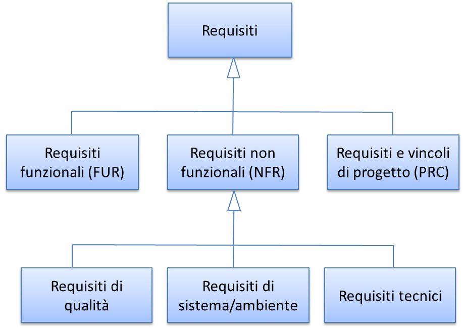

.. _classificazione-dei-requisiti:

Classificazione dei requisiti
=============================

Nell'ambito dei progetti di sviluppo o di manutenzione applicativa, è utile poter classificare i requisiti espressi dall'utente nelle categorie riportate nella figura che segue. Tale classificazione, con minime varianti, è condivisa da gran parte delle fonti esaminate nella ricognizione.

|image0|

Figura 1 - classificazione dei requisiti in un progetto di sviluppo o manutenzione

.. _requisiti-funzionali:

Requisiti funzionali
--------------------

I FUR (Functional User Requirement) descrivono le funzionalità del software in termini di:

-  servizi che il software stesso deve fornire;

-  risposte che l'utente aspetta dal software in determinate condizioni;

-  risultati che il software deve produrre in risposta a specifici input.

Tabella 6: esempio di FUR

+------------------+--------------------------------------------------------------------------------+
| **ID Requisito** | **Descrizione**                                                                |
+==================+================================================================================+
| RF1              | Premendo il tasto "salva", il documento corrente viene salvato sul disco fisso |
+------------------+--------------------------------------------------------------------------------+

.. _requisiti-e-vincoli-di-progetto:

Requisiti e vincoli di progetto
-------------------------------

I PRC (Project Requirement and Constraint) sono requisiti e vincoli che non afferiscono direttamente al prodotto software, bensì definiscono caratteristiche del progetto di sviluppo o manutenzione. Rientrano in questa categoria:

-  obiettivi temporali del progetto (schedulazione, date di consegna);

-  risorse a disposizione (budget, competenze degli sviluppatori, esperienza del capo progetto);

-  strumenti e metodologie di conduzione del progetto (processo di produzione, uso di CASE, rischi e dipendenze da altre iniziative al di fuori del controllo del responsabile di progetto).

Tabella 7: esempi di PRC

+--------------------------+-----------------------------------------------------------------------------------------------------------------+
| **ID Requisito/Vincolo** | **Descrizione**                                                                                                 |
+==========================+=================================================================================================================+
| RP1                      | Termine indifferibile (giorno xxx) per il rilascio della versione definitiva.                                   |
+--------------------------+-----------------------------------------------------------------------------------------------------------------+
| RP2                      | Nella prima fase l'utente non ha chiare le proprie esigenze, è necessario procedere per affinamenti successivi. |
+--------------------------+-----------------------------------------------------------------------------------------------------------------+
| RP3                      | I programmatori a disposizione non conoscono una delle tecnologie previste nel progetto.                        |
+--------------------------+-----------------------------------------------------------------------------------------------------------------+

.. _requisiti-di-qualità:

Requisiti di qualità
--------------------

I requisiti di qualità sono il sottoinsieme dei NFR (Non Functional Requirement) che descrivono le caratteristiche di qualità del prodotto software da sviluppare o mantenere.

Per la definizione di "caratteristiche di qualità del prodotto software" si rimanda alla norma ISO/IEC 25010, che identifica gli elementi riportati nella tabella che segue [1]_.

Tabella 8 - Caratteristiche e sottocaratteristiche di qualità ISO/IEC 25010

+------------------------+----------------------------------+-------------------------------------------------------------------------------------------------------------------------------------------------------------------------------------------------------------------------------------------------------------------------------------------------------------------------------------------------------------------------------------------------------+
| **Caratteristica**     | **Sottocaratteristica**          | **Descrizione**                                                                                                                                                                                                                                                                                                                                                                                       |
+========================+==================================+=======================================================================================================================================================================================================================================================================================================================================================================================================+
| Prestazioni/efficienza | Tempi di risposta                | Rispetto dei requisiti per quanto concerne i tempi di risposta e di elaborazione e il throughput.                                                                                                                                                                                                                                                                                                     |
+------------------------+----------------------------------+-------------------------------------------------------------------------------------------------------------------------------------------------------------------------------------------------------------------------------------------------------------------------------------------------------------------------------------------------------------------------------------------------------+
|                        | Consumo di risorse               | Rispetto dei requisiti per quanto concerne la quantità e i tipi di risorse utilizzate.                                                                                                                                                                                                                                                                                                                |
+------------------------+----------------------------------+-------------------------------------------------------------------------------------------------------------------------------------------------------------------------------------------------------------------------------------------------------------------------------------------------------------------------------------------------------------------------------------------------------+
|                        | Capacità                         | Rispetto dei requisiti per quanto riguarda i limiti massimi di un prodotto o i parametri di un sistema.                                                                                                                                                                                                                                                                                               |
|                        |                                  |                                                                                                                                                                                                                                                                                                                                                                                                       |
|                        |                                  | Nota: i parametri possono includere il numero di elementi che è possibile memorizzare, il numero di utenti simultanei, la larghezza di banda della comunicazione, la velocità effettiva delle transazioni e la dimensione del database.                                                                                                                                                               |
+------------------------+----------------------------------+-------------------------------------------------------------------------------------------------------------------------------------------------------------------------------------------------------------------------------------------------------------------------------------------------------------------------------------------------------------------------------------------------------+
| Usabilità              | Appropriatezza, riconoscibilità  | Livello di riconoscibilità dell'adeguatezza del prodotto/sistema rispetto alle esigenze degli utenti.                                                                                                                                                                                                                                                                                                 |
|                        |                                  |                                                                                                                                                                                                                                                                                                                                                                                                       |
|                        |                                  | Nota 1: la riconoscibilità dell'adeguatezza dipende dalla capacità di riconoscere l'adeguatezza del prodotto e le funzioni del sistema, dalle impressioni iniziali degli utenti e/o dalle caratteristiche della documentazione.                                                                                                                                                                       |
|                        |                                  |                                                                                                                                                                                                                                                                                                                                                                                                       |
|                        |                                  | Nota 2: le informazioni fornite possono includere dimostrazioni, tutorial, documentazione o, per un sito web, la descrizione della home page.                                                                                                                                                                                                                                                         |
+------------------------+----------------------------------+-------------------------------------------------------------------------------------------------------------------------------------------------------------------------------------------------------------------------------------------------------------------------------------------------------------------------------------------------------------------------------------------------------+
|                        | Apprendibilità                   | Grado di adeguatezza del prodotto/sistema a essere utilizzato da determinati utenti al fine di raggiungere determinati obiettivi di apprendimento e su come utilizzarlo con soddisfazione, efficacia, efficienza e senza rischi.                                                                                                                                                                      |
|                        |                                  |                                                                                                                                                                                                                                                                                                                                                                                                       |
|                        |                                  | Nota: è il grado in cui il prodotto/sistema può essere utilizzato da utenti specifici per raggiungere determinati obiettivi di apprendimento su come usare il prodotto/sistema con soddisfazione, in modo efficace ed efficiente, senza rischi in uno specificato contesto.                                                                                                                           |
+------------------------+----------------------------------+-------------------------------------------------------------------------------------------------------------------------------------------------------------------------------------------------------------------------------------------------------------------------------------------------------------------------------------------------------------------------------------------------------+
|                        | Operabilità                      | Livello di facilità e controllabilità del prodotto/sistema durante il suo utilizzo.                                                                                                                                                                                                                                                                                                                   |
|                        |                                  |                                                                                                                                                                                                                                                                                                                                                                                                       |
|                        |                                  | Nota: l'operabilità è assimilabile alla controllabilità, alla tolleranza agli errori dell'utente e alla conformità con le aspettative dell'utente stesso.                                                                                                                                                                                                                                             |
+------------------------+----------------------------------+-------------------------------------------------------------------------------------------------------------------------------------------------------------------------------------------------------------------------------------------------------------------------------------------------------------------------------------------------------------------------------------------------------+
|                        | Protezione dall'errore utente    | Livello di protezione dagli errori e prevenzione degli errori che l'utente può commettere.                                                                                                                                                                                                                                                                                                            |
+------------------------+----------------------------------+-------------------------------------------------------------------------------------------------------------------------------------------------------------------------------------------------------------------------------------------------------------------------------------------------------------------------------------------------------------------------------------------------------+
|                        | Estetica dell'interfaccia utente | Gradevolezza dell'uso dell'interfaccia utente.                                                                                                                                                                                                                                                                                                                                                        |
|                        |                                  |                                                                                                                                                                                                                                                                                                                                                                                                       |
|                        |                                  | Nota: Proprietà del prodotto/sistema che favoriscono il piacere e la soddisfazione dell'utente, Es. uso di colori appropriati e adeguato disegno grafico dell'interfaccia.                                                                                                                                                                                                                            |
+------------------------+----------------------------------+-------------------------------------------------------------------------------------------------------------------------------------------------------------------------------------------------------------------------------------------------------------------------------------------------------------------------------------------------------------------------------------------------------+
|                        | Accessibilità                    | Capacità del sistema/prodotto di essere utilizzato da utenti con la più ampia gamma di caratteristiche e capacità al fine di raggiungere un obiettivo in uno specifico contesto di utilizzo.                                                                                                                                                                                                          |
|                        |                                  |                                                                                                                                                                                                                                                                                                                                                                                                       |
|                        |                                  | Nota 1: le caratteristiche e capacità includono le disabilità associate all'età.                                                                                                                                                                                                                                                                                                                      |
|                        |                                  |                                                                                                                                                                                                                                                                                                                                                                                                       |
|                        |                                  | Nota 2: è il grado in cui un prodotto o un sistema può essere utilizzato da utenti con disabilità specifiche per raggiungere obiettivi specifici con efficacia, efficienza, assenza di rischio e soddisfazione.                                                                                                                                                                                       |
+------------------------+----------------------------------+-------------------------------------------------------------------------------------------------------------------------------------------------------------------------------------------------------------------------------------------------------------------------------------------------------------------------------------------------------------------------------------------------------+
| Affidabilità           | Maturità                         | Quanto il prodotto o la componente soddisfa le esigenze di affidabilità durante il normale funzionamento.                                                                                                                                                                                                                                                                                             |
|                        |                                  |                                                                                                                                                                                                                                                                                                                                                                                                       |
|                        |                                  | Nota: il concetto di maturità può anche essere applicato ad altre caratteristiche di qualità per indicare quanto dette caratteristiche soddisfano le esigenze, durante il normale funzionamento.                                                                                                                                                                                                      |
+------------------------+----------------------------------+-------------------------------------------------------------------------------------------------------------------------------------------------------------------------------------------------------------------------------------------------------------------------------------------------------------------------------------------------------------------------------------------------------+
|                        | Disponibilità                    | Livello di operatività e accessibilità del sistema/prodotto/ componente.                                                                                                                                                                                                                                                                                                                              |
|                        |                                  |                                                                                                                                                                                                                                                                                                                                                                                                       |
|                        |                                  | Nota: esternamente, la disponibilità può essere valutata in base alla quantità di tempo totale durante il quale il sistema, il prodotto o il componente si trova in uno stato attivo. La disponibilità è quindi una combinazione di maturità (che dipende dalla frequenza di malfunzioni), tolleranza agli errori e recuperabilità (che dipende dal tempo di inattività successivo a ciascun guasto). |
+------------------------+----------------------------------+-------------------------------------------------------------------------------------------------------------------------------------------------------------------------------------------------------------------------------------------------------------------------------------------------------------------------------------------------------------------------------------------------------+
|                        | Tolleranza agli errori           | Capacità di sistema/prodotto/componente di funzionare come previsto nonostante la presenza di errori hardware o software.                                                                                                                                                                                                                                                                             |
+------------------------+----------------------------------+-------------------------------------------------------------------------------------------------------------------------------------------------------------------------------------------------------------------------------------------------------------------------------------------------------------------------------------------------------------------------------------------------------+
|                        | Recuperabilità                   | In caso di guasto e interruzione del funzionamento, è la capacità del prodotto/sistema di recuperare i dati direttamente interessati e ripristinare lo stato di funzionamento desiderato.                                                                                                                                                                                                             |
|                        |                                  |                                                                                                                                                                                                                                                                                                                                                                                                       |
|                        |                                  | Nota: in caso di errore, i sistemi informatici possono rimanere inutilizzabili per un determinato periodo di tempo. La misura di questo intervallo di tempo è una indicazione delle caratteristiche di recuperabilità.                                                                                                                                                                                |
+------------------------+----------------------------------+-------------------------------------------------------------------------------------------------------------------------------------------------------------------------------------------------------------------------------------------------------------------------------------------------------------------------------------------------------------------------------------------------------+
| Sicurezza              | Riservatezza                     | Livello al quale il prodotto/sistema garantisce che un insieme di dati siano accessibili solo agli utenti in possesso delle autorizzazioni per accedervi.                                                                                                                                                                                                                                             |
+------------------------+----------------------------------+-------------------------------------------------------------------------------------------------------------------------------------------------------------------------------------------------------------------------------------------------------------------------------------------------------------------------------------------------------------------------------------------------------+
|                        | Integrità                        | Capacità del prodotto/sistema/componente di impedire l'accesso non autorizzato o la modifica di programmi/dati.                                                                                                                                                                                                                                                                                       |
+------------------------+----------------------------------+-------------------------------------------------------------------------------------------------------------------------------------------------------------------------------------------------------------------------------------------------------------------------------------------------------------------------------------------------------------------------------------------------------+
|                        | Non ripudio                      | Capacità di poter dimostrare che azioni o eventi hanno avuto luogo, in modo che detti eventi e azioni non possano essere ripudiati successivamente.                                                                                                                                                                                                                                                   |
+------------------------+----------------------------------+-------------------------------------------------------------------------------------------------------------------------------------------------------------------------------------------------------------------------------------------------------------------------------------------------------------------------------------------------------------------------------------------------------+
|                        | Responsabilità                   | Capacità di poter verificare che le azioni svolte da una determinata entità siano effettivamente state svolte da detta entità.                                                                                                                                                                                                                                                                        |
+------------------------+----------------------------------+-------------------------------------------------------------------------------------------------------------------------------------------------------------------------------------------------------------------------------------------------------------------------------------------------------------------------------------------------------------------------------------------------------+
|                        | Autenticità                      | Capacità di poter dimostrare che l'identità di un determinato soggetto corrisponda a quella rivendicata dal soggetto stesso.                                                                                                                                                                                                                                                                          |
+------------------------+----------------------------------+-------------------------------------------------------------------------------------------------------------------------------------------------------------------------------------------------------------------------------------------------------------------------------------------------------------------------------------------------------------------------------------------------------+
| Manutenibilità         | Modularità                       | Caratteristica di un programma per computer di essere costituito da componenti discreti in modo tale che una modifica su un componente abbia un impatto minimo su altri componenti.                                                                                                                                                                                                                   |
+------------------------+----------------------------------+-------------------------------------------------------------------------------------------------------------------------------------------------------------------------------------------------------------------------------------------------------------------------------------------------------------------------------------------------------------------------------------------------------+
|                        | Riusabilità                      | Caratteristica di un asset di poter essere utilizzato in più di un sistema o nella costruzione di altri asset.                                                                                                                                                                                                                                                                                        |
+------------------------+----------------------------------+-------------------------------------------------------------------------------------------------------------------------------------------------------------------------------------------------------------------------------------------------------------------------------------------------------------------------------------------------------------------------------------------------------+
|                        | Analizzabilità                   | Grado di efficacia ed efficienza con cui è possibile valutare l'impatto che un cambiamento effettuato su una o più componenti di un prodotto/sistema può avere sul prodotto/sistema stesso. Oppure per individuare le carenze e/o le cause di possibili guasti e/o per identificare eventuali componenti da modificare                                                                                |
|                        |                                  |                                                                                                                                                                                                                                                                                                                                                                                                       |
|                        |                                  | Nota: l'implementazione può includere la fornitura di meccanismi che consentano al prodotto/sistema di analizzare i propri errori e fornire report prima del verificarsi di errori o di altri eventi.                                                                                                                                                                                                 |
+------------------------+----------------------------------+-------------------------------------------------------------------------------------------------------------------------------------------------------------------------------------------------------------------------------------------------------------------------------------------------------------------------------------------------------------------------------------------------------+
|                        | Modificabilità                   | Caratteristica di un prodotto o un sistema di poter essere modificato in modo efficace ed efficiente senza introdurre difetti o degradarne la qualità.                                                                                                                                                                                                                                                |
|                        |                                  |                                                                                                                                                                                                                                                                                                                                                                                                       |
|                        |                                  | Nota 1: l'implementazione della modifica include la codifica, la progettazione, la documentazione e la verifica.                                                                                                                                                                                                                                                                                      |
|                        |                                  |                                                                                                                                                                                                                                                                                                                                                                                                       |
|                        |                                  | Nota 2: modularità e analizzabilità possono influenzare la modificabilità.                                                                                                                                                                                                                                                                                                                            |
|                        |                                  |                                                                                                                                                                                                                                                                                                                                                                                                       |
|                        |                                  | Nota 3: la modificabilità è una combinazione di mutabilità e stabilità.                                                                                                                                                                                                                                                                                                                               |
+------------------------+----------------------------------+-------------------------------------------------------------------------------------------------------------------------------------------------------------------------------------------------------------------------------------------------------------------------------------------------------------------------------------------------------------------------------------------------------+
|                        | Testabilità                      | Grado di efficacia ed efficienza con cui possono essere stabiliti i criteri di prova per un sistema, prodotto o componente, e possono essere eseguiti specifici test per determinare se tali criteri sono stati soddisfatti.                                                                                                                                                                          |
+------------------------+----------------------------------+-------------------------------------------------------------------------------------------------------------------------------------------------------------------------------------------------------------------------------------------------------------------------------------------------------------------------------------------------------------------------------------------------------+
| Idoneità funzionale    | Copertura                        | Livello di copertura di tutte le attività e obiettivi utente da parte delle funzioni definite.                                                                                                                                                                                                                                                                                                        |
+------------------------+----------------------------------+-------------------------------------------------------------------------------------------------------------------------------------------------------------------------------------------------------------------------------------------------------------------------------------------------------------------------------------------------------------------------------------------------------+
|                        | Correttezza                      | Livello al quale un prodotto o un sistema fornisce i risultati corretti con il grado di precisione necessario.                                                                                                                                                                                                                                                                                        |
+------------------------+----------------------------------+-------------------------------------------------------------------------------------------------------------------------------------------------------------------------------------------------------------------------------------------------------------------------------------------------------------------------------------------------------------------------------------------------------+
|                        | Adeguatezza                      | Livello al quale le funzioni consentono di svolgere i compiti e gli obiettivi specificati.                                                                                                                                                                                                                                                                                                            |
|                        |                                  |                                                                                                                                                                                                                                                                                                                                                                                                       |
|                        |                                  | Esempio: all'utente sono proposti solo i passi necessari a completare un'attività, escludendo i passi superflui.                                                                                                                                                                                                                                                                                      |
+------------------------+----------------------------------+-------------------------------------------------------------------------------------------------------------------------------------------------------------------------------------------------------------------------------------------------------------------------------------------------------------------------------------------------------------------------------------------------------+
| Compatibilità          | Coesistenza                      | Capacità di un prodotto di svolgere le funzioni richieste in modo efficiente, condividendo un ambiente e risorse con altri prodotti, senza impatto negativo su questi ultimi.                                                                                                                                                                                                                         |
+------------------------+----------------------------------+-------------------------------------------------------------------------------------------------------------------------------------------------------------------------------------------------------------------------------------------------------------------------------------------------------------------------------------------------------------------------------------------------------+
|                        | Interoperabilità                 | Capacità di due o più sistemi, prodotti o componenti di scambiarsi informazioni e utilizzare le informazioni scambiate.                                                                                                                                                                                                                                                                               |
+------------------------+----------------------------------+-------------------------------------------------------------------------------------------------------------------------------------------------------------------------------------------------------------------------------------------------------------------------------------------------------------------------------------------------------------------------------------------------------+
| Portabilità            | Adattabilità                     | Capacità di un prodotto/sistema di poter essere adattato in modo efficace ed efficiente a funzionare su hardware e con software differenti da quelli iniziali o in altri ambienti operativi o in contesti di utilizzo diversi.                                                                                                                                                                        |
|                        |                                  |                                                                                                                                                                                                                                                                                                                                                                                                       |
|                        |                                  | Nota 1: l'adattabilità include la scalabilità interna (ad esempio campi dello schermo, tabelle, volumi delle transazioni, formati dei report, ecc.).                                                                                                                                                                                                                                                  |
|                        |                                  |                                                                                                                                                                                                                                                                                                                                                                                                       |
|                        |                                  | Nota 2: gli adattamenti includono quelli effettuati da personale di supporto specializzato e quelli effettuati da personale operativo o dagli utenti finali.                                                                                                                                                                                                                                          |
+------------------------+----------------------------------+-------------------------------------------------------------------------------------------------------------------------------------------------------------------------------------------------------------------------------------------------------------------------------------------------------------------------------------------------------------------------------------------------------+
|                        | Installabilità                   | Grado di efficacia ed efficienza con cui un prodotto o sistema può essere installato e/o disinstallato con successo in un determinato ambiente.                                                                                                                                                                                                                                                       |
|                        |                                  |                                                                                                                                                                                                                                                                                                                                                                                                       |
|                        |                                  | Nota 1: se il prodotto o il sistema deve essere installato da un utente finale, l'installabilità può influire sull'adeguatezza e sull'operabilità funzionale risultanti.                                                                                                                                                                                                                              |
+------------------------+----------------------------------+-------------------------------------------------------------------------------------------------------------------------------------------------------------------------------------------------------------------------------------------------------------------------------------------------------------------------------------------------------------------------------------------------------+
|                        | Sostituibilità                   | Capacità di un prodotto di sostituire un altro prodotto software con lo stesso scopo e nello stesso ambiente.                                                                                                                                                                                                                                                                                         |
|                        |                                  |                                                                                                                                                                                                                                                                                                                                                                                                       |
|                        |                                  | Nota 1: la sostituzione di una nuova versione di un prodotto software è importante per l'utente durante l'aggiornamento.                                                                                                                                                                                                                                                                              |
|                        |                                  |                                                                                                                                                                                                                                                                                                                                                                                                       |
|                        |                                  | Nota 2: la sostituibilità può includere attributi sia di installabilità che di adattabilità.                                                                                                                                                                                                                                                                                                          |
|                        |                                  |                                                                                                                                                                                                                                                                                                                                                                                                       |
|                        |                                  | Nota 3: la sostituibilità riduce il rischio di lock-in, prevedendo che altri prodotti software possano essere utilizzati al posto di quello attuale, ad esempio mediante l'uso di formati di file standardizzati.                                                                                                                                                                                     |
+------------------------+----------------------------------+-------------------------------------------------------------------------------------------------------------------------------------------------------------------------------------------------------------------------------------------------------------------------------------------------------------------------------------------------------------------------------------------------------+

Tabella 9: esempio di requisito di qualità

+------------------+-------------------------------------------------------------------------------------------------------+
| **ID Requisito** | **Descrizione**                                                                                       |
+==================+=======================================================================================================+
| RQ1              | Il tempo di risposta del sistema all'inserimento della password utente deve essere inferiore a 10 sec |
+------------------+-------------------------------------------------------------------------------------------------------+

.. _requisiti-di-sistemaambiente:

Requisiti di sistema/ambiente
-----------------------------

Questa classe di requisiti descrive:

-  il dominio dell'applicazione (es. software di contabilità, business intelligence, ecc.);

-  il contesto di utilizzo (numero e tipologia di utenti, modalità di accesso);

-  elementi legati all'ambiente fisico in cui il software deve operare.

Tabella 10: esempio di requisiti di sistema/ambiente

+------------------+-----------------------------------------------------------------------------------------+
| **ID Requisito** | **Descrizione**                                                                         |
+==================+=========================================================================================+
| RS1              | Il software dovrà operare su dispositivi portatili in ambienti con scarsa illuminazione |
+------------------+-----------------------------------------------------------------------------------------+
| RS2              | Il parco utenti comprende 10 amministratori e 1000 utenti di contabilità                |
+------------------+-----------------------------------------------------------------------------------------+

.. _requisiti-tecnici:

Requisiti tecnici
-----------------

Questa classe di requisiti descrive le tecnologie e gli standard (DBMS, middleware, networking) di cui il software deve tenere conto.

Tabella 11: esempio di requisiti tecnici

+------------------+------------------------------------------------------------------+
| **ID Requisito** | **Descrizione**                                                  |
+==================+==================================================================+
| RT1              | I documenti da rilasciare devono essere conformi al modello xxx. |
+------------------+------------------------------------------------------------------+
| RT2              | Il software dovrà operare in ambiente Linux e DBMS MySql         |
+------------------+------------------------------------------------------------------+

.. [1]
    Con l'obiettivo, già citato, di migliorare la fruibilità del documento, tutti i termini sono stati tradotti in italiano. Tuttavia, per qualsiasi contenzioso fa fede la norma internazionale, che ufficialmente è in lingua inglese.

