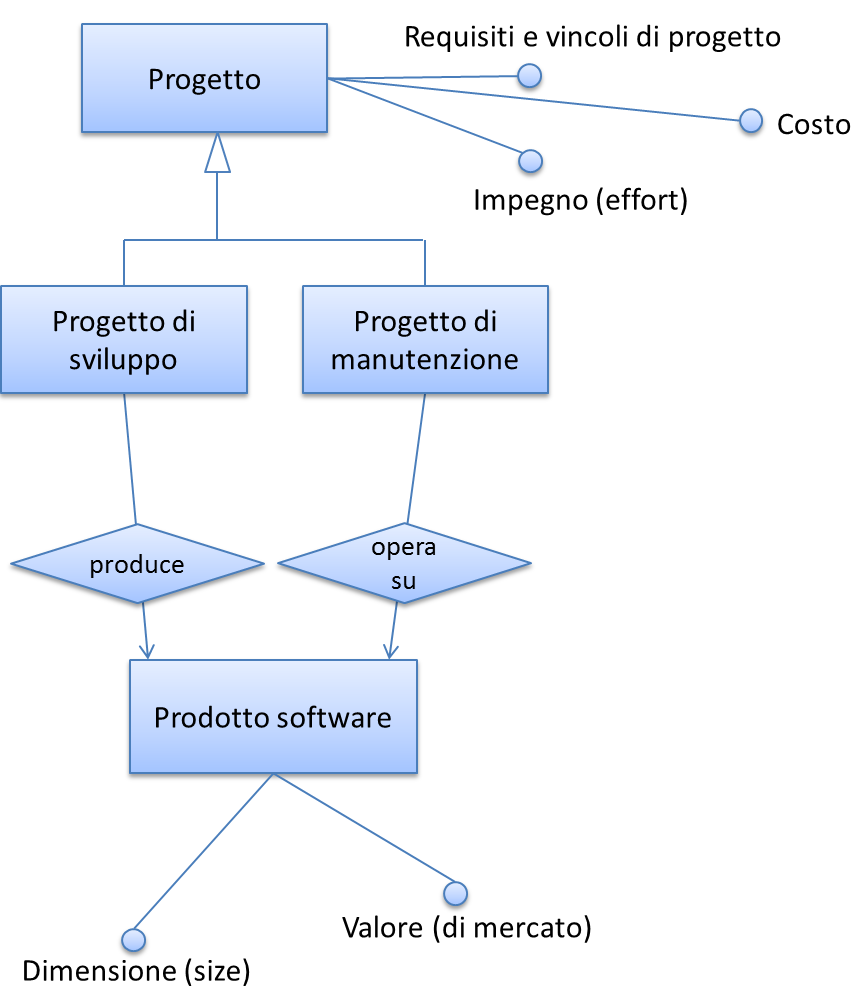

.. _dimensioni-del-prodotto-software:

Dimensioni del prodotto software
================================

La figura che segue illustra nella forma di un diagramma E-R le relazioni che, nel presente studio, si identificano tra le entità "prodotto software", "progetto" (generalizzazione di "progetto di sviluppo" e "progetto di manutenzione" [1]_) e i loro attributi.

Sulla dimensione di un prodotto software influiscono i requisiti funzionali e non funzionali del prodotto stesso. A sua volta, la dimensione ha impatto sul valore di mercato del prodotto software. I requisiti e vincoli di progetto influiscono sull'impegno di progetto. A sua volta, quest'ultimo determina (in massima parte) il costo del progetto stesso.

Nel diagramma di figura 2 (ideato per modellare lo scenario tipico dei contratti con pagamento "a misura" delle pubbliche amministrazioni), il costo di un progetto di sviluppo di un prodotto software non ha relazione diretta con il valore di quest'ultimo. Con tale assunto si vuole svincolare, a livello concettuale:

-  il costo del progetto, attributo di competenza e visibilità del fornitore;

-  il valore del prodotto software, attributo di interesse dell'amministrazione cliente, che quantifica monetariamente le necessità che l'amministrazione aveva espresso in termini di funzionalità e requisiti di qualità/tecnici, e che il prodotto software rilasciato fornisce.

|image0|

Figura 2: relazione tra progetti e prodotti software

Si ritiene che questa separazione concettuale possa aiutare a risolvere alcune delle criticità rappresentate al §1.4. In particolare, si ritiene che svincolare il costo del progetto dal valore del prodotto possa motivare il fornitore a migliorare i propri processi produttivi così da abbattere i costi a parità di ricavi. A oggi, infatti, molti dei contratti pubblici che prevedono pagamenti "a misura" vengono poi gestiti, retroattivamente, in modo da coprire comunque i costi come ci si trovasse in forniture a tempo e spesa: in questi casi il fornitore non ha alcuna motivazione a rendersi più efficiente, ma anzi tende ad aumentare l'impegno erogato per essere pagato di più.

È anche vero che, in una situazione "sana", il valore di un software commissionato ad hoc (vale a dire l'importo che viene pagato dal cliente) deve sostenere il costo di produzione e il margine del fornitore. In altri termini, deve essere verificata la diseguaglianza:

**Valore del prodotto sw > Costo di produzione**

Se così non è, oppure se la differenza tra valore e costo di produzione è insufficiente come margine per il fornitore, siamo in presenza di un'anomalia. Si noti che situazioni di questo tipo si verificano talvolta nei progetti delle pubbliche amministrazioni, ad esempio nell'ambito di grandi contratti poliennali che includono numerosi progetti: in questi casi, costi superiori ai ricavi in un singolo progetto devono trovare compensazione negli altri progetti del contratto o in voci separate dello stesso, ma – come detto - possono anche motivare il fornitore a ottimizzare i suoi processi interni per comprimere i costi e riportarsi in una situazione di redditività.

.. [1]
    In questa modellizzazione non si considerano le attività di esercizio di un'applicazione software (OPS) in quanto si ritengono di natura non progettuale ma di servizio.

