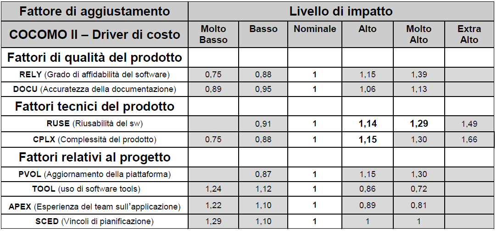

.. _analisi-di-capitolati-e-schemi-contrattuali:

Analisi di capitolati e schemi contrattuali
===========================================

Nell'ambito della documentazione raccolta dal Tavolo di lavoro, sono stati oggetto di specifica analisi schemi di contratto, capitolati e altra documentazione di gara riguardante attività di sviluppo e manutenzione di software applicativo.

Come primo obiettivo, si è cercato di capire in che modo viene attualmente regolato, nella documentazione contrattuale della P.A., l'uso di metriche del software. Successivamente, sulla scorta delle criticità riscontrate, sono stati formulati alcuni suggerimenti, di ordine generale, sulla scrittura di capitolati e articolati contrattuali.

.. _situazione-attuale:

Situazione attuale
------------------

Come anticipato al §1.3, l'uso di metriche del software nei contratti e nei capitolati delle P.A. è, nella stragrande maggioranza dei casi, limitato ai Punti Funzione. Le amministrazioni, in molti casi, sono consapevoli dei limiti di questa metrica, tuttavia è prevalente un approccio "conservativo": le P.A. preferiscono attestarsi su clausole e articolati contrattuali consolidati, ben diffusi o in qualche modo "ufficializzati" anziché sperimentare contenuti innovativi, a volte percepiti come possibile fonte di contenziosi.

Esistono peraltro alcuni esempi d'innovazione in questo ambito. Essi verranno citati nei paragrafi che seguono.

.. _esempio-1-linee-guida-lombardia-informatica:

Esempio 1: linee guida Lombardia Informatica
~~~~~~~~~~~~~~~~~~~~~~~~~~~~~~~~~~~~~~~~~~~~

Tra il materiale pervenuto al Tavolo di lavoro, appare utile estrarre alcuni contenuti del documento "METODOLOGIE E LINEE GUIDA DI MISURA DEI FUNCTION POINT", redatto da Lombardia Informatica, allegato alla gara 3/2014/LI per l'affidamento dei servizi di supporto al demand management, sviluppo, manutenzione, assistenza per la realizzazione dei modelli di e-government della Regione Lombardia.

Nel suddetto documento (citato a titolo di esempio, senza entrare nel merito delle scelte effettuate dai suoi redattori) vengono anzitutto definiti 4 "livelli di misurazione" delle funzionalità del software, vale a dire:

-  misura approssimata (stima);

-  misura grezza (stima);

-  misura dettagliata;

-  misura approfondita.

Ogni livello di misurazione tiene conto delle informazioni disponibili nelle varie fasi del progetto: al crescere delle informazioni disponibili aumenta di precisione e di complessità nel conteggio.

Il documento prescrive che le misure richieste all'accettazione di nuovi sviluppi e manutenzioni evolutive siano di livello "dettagliate". Per obiettivi di controllo si usano invece misure di livello "approfondito". Per entrambi i livelli si prevede il metodo di misurazione IFPUG 4.3.1.

In fasi iniziali possono essere richieste al fornitore misure (o meglio "stime") di livello "approssimato" o "grezzo". Il livello "grezzo" è considerato accettabile per la prima valorizzazione richiesta al fornitore. Per le stime si prevede l'impiego del metodo Early & Quick Function Point (`E&QFP <https://www.researchgate.net/profile/Roberto_Meli/publication/258210227_EQFP_R_Early_Quick_Function_Points_for_IFPUG_method/links/02e7e5273e601b76d9000000/E-QFP-R-Early-Quick-Function-Points-for-IFPUG-method.pdf>`__) [1]_. Per il livello "grezzo" è anche possibile l'uso del metodo Simple Function Point, brevemente descritto al successivo §4.2.

Un concetto interessante presente in questo documento è la distinzione tra "misura funzionale" (in UFP) del software e "misura funzionale contrattuale" (MFC) dello stesso. Mentre la prima misura deriva dall'applicazione del metodo dei Punti Funzione IFPUG, la seconda misura tiene conto dei tre fattori seguenti:

-  riuso (sia generico che per incorporamento di servizi offerti da altre applicazioni), che diminuisce la MFC rispetto alla misura funzionale; il documento fissa le percentuali di abbattimento degli UFP da applicare nei vari scenari che possono verificarsi;

-  replica (ad esempio la necessità di duplicare la medesima funzionalità su più piattaforme), che aumenta la MFC rispetto alla misura funzionale; anche in questo caso il documento fissa la percentuale di innalzamento degli UFP da applicare nei vari scenari possibili;

-  change request (CR), vale a dire varianti di requisiti in corso d'opera, che aumentano la MFC.

Riguardo all'ultimo fattore (CR), il documento stabilisce le seguenti regole di conteggio, da applicarsi in caso di variazioni di requisiti in corso d'opera:

-  le funzionalità aggiunte (ADD) dovranno essere sia quelle individuate originariamente che quelle introdotte dalle CR;

-  le funzionalità modificate (CHG) dovranno essere sia quelle individuate originariamente che quelle introdotte successivamente dalle CR;

-  le funzionalità cancellate (DEL) dovranno essere sia quelle individuate originariamente che quelle introdotte successivamente dalle CR;

-  una funzionalità classificata come ADD o CHG che sia stata modificata due o più volte attraverso CR verrà moltiplicata per 1,4;

-  una funzionalità aggiunta con un cambiamento dei requisiti (ADD) che sia poi cancellata successivamente con un nuovo cambiamento dei requisiti sarà abbattuta del 50% e sarà identificata per escluderla dall'aggiornamento del patrimonio;

-  una funzionalità cancellata (DEL) che venga ripristinata con un cambiamento dei requisiti successivo non sarà conteggiata.

Per passare dalla misura funzionale in UFP alla MFC, il documento di Lombardia Informatica propone la formula:

**MFC = Σ\ i (UFP x SAC\ riuso x SAC\ replica x SAC\ CR)\ i**

Dove:

-  SAC: Size Adjustment Coefficient;

-  UFP: Unadjusted Function Point, rilasciati o da rilasciarsi, calcolati per ogni funzione secondo i dettami del metodo standard IFPUG;

-  SAC\ :sub:`riuso` è il fattore di abbattimento che si intende riconoscere alla funzionalità che gode di riuso;

-  SAC\ :sub:`replica` è il fattore di incremento che si intende riconoscere alla funzionalità che deve essere resa disponibile su due o più canali di fruizione;

-  SAC\ :sub:`CR` è il fattore di abbattimento o di incremento relativo alla funzionalità oggetto di CR.

Infine, nel documento vengono introdotti fattori correttivi al corrispettivo unitario contrattuale del Punto Funzione. Nell'ambito del medesimo contratto, è previsto che interventi progettuali distinti possano avere caratteristiche differenti, con impatto sulla produttività e dunque sul corrispettivo dell'intervento stesso. All'attivazione di ciascun intervento, cliente e fornitore verificano che le caratteristiche dell'intervento si discostino da quelle "nominali". In tal caso, al corrispettivo unitario contrattuale vengono applicati i coefficienti correttivi riportati nella tabella che segue. L'approccio deriva palesemente dal metodo Cocomo 2.1, le celle in bianco contengono i valori che sono stati ritenuti applicabili al caso di Lombardia Informatica.

Tabella 5: coefficienti correttivi da Cocomo

|image0|

Il corrispettivo unitario da applicare nel singolo intervento si calcola moltiplicando il corrispettivo "nominale" per i coefficienti riportati in tabella.

Riassumendo, Lombardia Informatica usa misure e stime delle caratteristiche funzionali, passa alla misura "contrattuale" MFC per tener conto di riuso, repliche e change request. Infine applica fattori correttivi al corrispettivo unitario considerando l'impatto delle caratteristiche di qualità del software, tecniche e di progetto. Per quest'ultimo passo utilizza metriche "discrete" tratte dal metodo Cocomo.

.. _esempio-2-lapproccio-sogei-per-lusabilità:

Esempio 2: l'approccio Sogei per l'usabilità
~~~~~~~~~~~~~~~~~~~~~~~~~~~~~~~~~~~~~~~~~~~~

Tra il materiale preso in esame, il Tavolo di lavoro ha analizzato il documento Sogei "Linee guida per l'accessibilità e l'usabilità di siti ed applicazioni web" (DA-00-WE-01 26 novembre 2013) [2]_, che ha l'obiettivo di fissare indicazioni e soglie minime accettabili che fornitori e sviluppatori sono tenuti a rispettare per rendere accessibili, ai sensi della normativa vigente, informazioni e servizi resi disponibili mediante siti, applicazioni web nonché prodotti a scaffale.

Nel documento sono richiamati i 12 requisiti di accessibilità stabiliti dalla normativa; per ciascuno di essi sono fornite indicazioni tecniche per la corretta applicazione e verifica/test degli stessi.

In appendice, il documento contiene i modelli che il fornitore deve consegnare compilati a Sogei, in sede di collaudo, per dichiarare la conformità alla normativa del sito/applicazione rilasciato.

Nel merito, si ritiene che l'approccio di Sogei sia utile come base di partenza. Un'evoluzione interessante potrebbe consistere nel derivare, dai modelli in appendice al documento, indicatori per quantificare il grado di conformità di un prodotto software ai requisiti di accessibilità (in prospettiva, metriche di accessibilità).

La disponibilità di tali metriche sarebbe utilissima:

-  per misurare il livello di accessibilità di parchi applicativi esistenti;

-  per fissare quantitativamente il livello di accessibilità desiderato (una volta superato il minimo da rispettare) per un software da sviluppare;

-  per definire in maniera oggettiva, in progetti per migliorare l'accessibilità di un software, il lavoro da effettuare (come differenza tra la misura iniziale e quella desiderata), e per stimare l'impegno e dunque i costi relativi.

.. _esempio-3-sin-agea:

Esempio 3: SIN-AGEA
~~~~~~~~~~~~~~~~~~~

Il terzo contributo preso in esame è il documento "Istruzioni operative: metodologia e linee guida per la misurazione del software" del 5 febbraio 2014, redatto dalla società SIN e utilizzato nell'ambito del contratto quadro con L'Agenzia per le Erogazioni in Agricoltura (AGEA), sia per i conteggi effettuati da SIN per AGEA, sia per i contratti con fornitori esterni per i quali SIN effettua funzioni amministrative e di governo, come da atto esecutivo A08-01 del contratto di servizio quadro AGEA-SIN del 17 novembre 2008.

In generale il documento appare rifarsi alle regole di conteggio IFPUG versione 4.3.1. Prevede anche, per le stime, l'uso del metodo Early & Quick Function Point 3.1. Fornisce poi suggerimenti operativi su come effettuare il conteggio nelle casistiche:

-  presenza di middleware;

-  applicazioni datawarehouse;

-  applicazioni web based;

-  applicazioni GIS;

-  architetture a componenti.

In tutti questi casi non si discosta significativamente dai contenuti del documento di Lombardia Informatica di cui al §2.4.1.1)

Appare invece seguire un diverso approccio nell'introduzione della c.d. "Misura Funzionale Adeguata" (MFA).

A differenza del caso di Lombardia Informatica (che definiva una misura funzionale contrattuale e un insieme di corrispettivi unitari per la remunerazione del fornitore), in questo caso il corrispettivo unitario del PF è fissato contrattualmente al medesimo valore per tutte le tipologie di applicazione (cioè è indipendente dalle caratteristiche non funzionali). Pertanto, per tenere conto di queste ultime, la modifica avviene sulla misura, passando da UFP a MFA con la formula:

**MFA = UFP \* FattAd**

Il fattore di adeguamento (FattAd) tiene conto:

-  del riuso e della replicazione di funzionalità;

-  delle modifiche in corso d'opera (CR);

-  di requisiti tecnici e di qualità del software.

L'ultimo gruppo include, secondo il documento, i seguenti elementi (tratti dal metodo Cocomo):

-  Affidabilità (RELY);

-  Complessità (CPLX);

-  Riusabilità (RUSE);

-  Prestazioni (TIME);

-  Utilizzo di Tool.

Il documento specifica che l'uso o meno del fattore di adeguamento deve essere stabilito in fase di attivazione del singolo intervento, insieme alla categoria di funzioni su cui va usato e ai relativi valori.

Il riuso, la replicazione di funzionalità e le CR sono trattate in modo sostanzialmente analogo al caso di Lombardia Informatica, cui si rimanda. Anche per i requisiti tecnici e di qualità, nel documento si fa uso dei coefficienti del metodo Cocomo: è presente una lista di valori analoga a quella di Tabella 3, con in più una riga relativa al requisito TIME (vincoli sui tempi di esecuzione). Si segnala che per il requisito TOOL (Utilizzo di tool, applicato soprattutto nelle applicazioni di datawarehouse) il documento non prevede l'utilizzo dei coefficienti Cocomo, bensì fissa i seguenti valori:

-  0,6 per tutte le funzioni e i file logici già conteggiati (tipo operazione = CHG);

-  0,8 per EO ed EQ di nuova realizzazione (tipo operazione = ADD).

La MFA del singolo elemento di conteggio è calcolata moltiplicando il numero di UFP del singolo elemento per il fattore di adeguamento. La MFA totale è calcolata sommando le MFA dei singoli elementi (il documento fornisce anche alcuni esempi pratici di conteggio e adeguamento). Infine, la MFA così ottenuta viene moltiplicata per il corrispettivo unitario previsto contrattualmente, per calcolare l'importo da corrispondere al fornitore.

In conclusione, il percorso metodologico previsto in questo esempio è simile a quello di Lombardia Informatica, ma include una "forzatura concettuale" perché deve comunque adeguarsi a un articolato contrattuale rigido che prevede un unico valore per il corrispettivo unitario del PF.

.. _suggerimenti-e-proposte:

Suggerimenti e proposte
-----------------------

Sulla scorta di quanto sopra, si può anticipare qualche indicazione di ordine generale per la redazione di capitolati e schemi contrattuali. Per indicazioni di dettaglio relativi alle singole tipologie progettuali in cui si declinano le attività di sviluppo e manutenzione applicativa, si rimanda al capitolo 6.

Nella scrittura dei requisiti del software da realizzare (o del servizio di manutenzione da erogare) le amministrazioni devono impiegare, ove possibile, definizioni di tipo quantitativo, identificando gli elementi misurabili, fissando soglie oggettive e valori univoci. Per chiarire con un esempio, un requisito dalla definizione vaga e qualitativa del tipo "*L'applicazione dovrà essere scalabile*" (dizione effettivamente rilevata in più di un capitolato pubblico) non è accettabile: una formulazione quantitativa della stessa esigenza potrebbe essere, ad esempio, "*L'applicazione dovrà tollerare un aumento del 100% del numero di utenti connessi con un degrado prestazionale inferiore al 10% misurato sui tempi di risposta*".

La medesima cura va applicata alla scrittura degli SLA, indicando ove possibile le metriche per la loro misurazione e controllo. In alcuni contesti, l'amministrazione potrà chiedere allo stesso partecipante alla gara di proporre metriche e metodologie per la misurazione degli SLA: tali elementi potranno concorrere ad attribuire il punteggio tecnico dell'offerta in esame.

I contratti di sviluppo e manutenzione applicativa dovrebbero passare dal modello di retribuzione basato sulla dimensione funzionale del software prodotto (o in manutenzione), a modelli più articolati che introducano meccanismi di premialità legati alla qualità del prodotto rilasciato, ad esempio quote sospese degli importi, da pagare solo al raggiungimento di soglie definite di indicatori di qualità. Si rimanda al capitolo 6 per applicazioni pratiche di questa raccomandazione.

In generale, gli attuali schemi contrattuali sembrano troppo rigidi. Si sono rilevati casi di contratti di sviluppo applicativo in cui l'unica metrica prevista (i Punti Funzione) era palesemente inadatta a quantificare attività facenti parte della fornitura (es. realizzazione di documentazione utente e tutorial, installazione su sedi periferiche, parametrizzazione di prodotti di mercato) con la conseguenza che – nel corso delle attività – l'amministrazione si è trovata nella necessità di trattare i PF come unità monetaria e di effettuare "conversioni" quantomeno arbitrarie per riuscire ad applicare comunque le clausole contrattuali.

Una maggiore flessibilità dei contratti eviterebbe applicazioni incorrette o negoziazioni successive tra amministrazione e fornitore per consentire la gestione del progetto nell'ambito di una "gabbia" contrattuale troppo stretta.

.. [1]
    http://www.dpo.it/eqfp/

.. [2]
    Il documento è stato acquisito da AgID nell'ambito dell'istruttoria di un parere, reso ai sensi dell'art. 14bis del CAD, su una gara bandita da Consip per conto della RGS.

