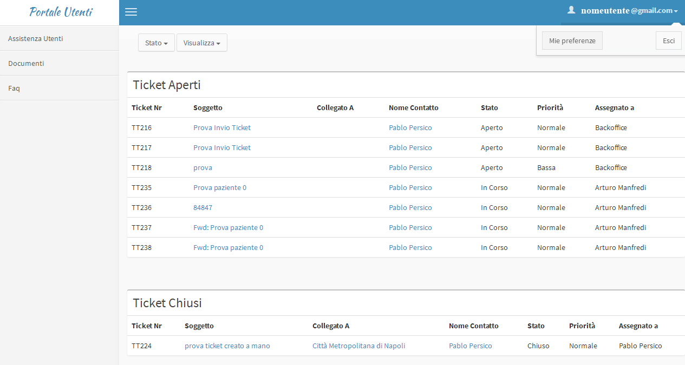

.. _accesso-al-portale-utenti:

4. Accesso al Portale Utenti
============================

Inserite le credenziali si accederà al portale

|Assistenza Utenti Portale Utente|

Figura - home page Assistenza Utenti

Per uscire correttamente dal portale cliccare in alto a destra nel menu recante il vostro indirizzo mail e scegliere la voce **"esci"**

.. toctree::
   :maxdepth: 3

   accesso-al-portale-utenti/creare-un-ticket.rst
   accesso-al-portale-utenti/aggiungere-un-allegato.rst
   accesso-al-portale-utenti/inviare-un-commento.rst
   accesso-al-portale-utenti/documenti-e-faq.rst

