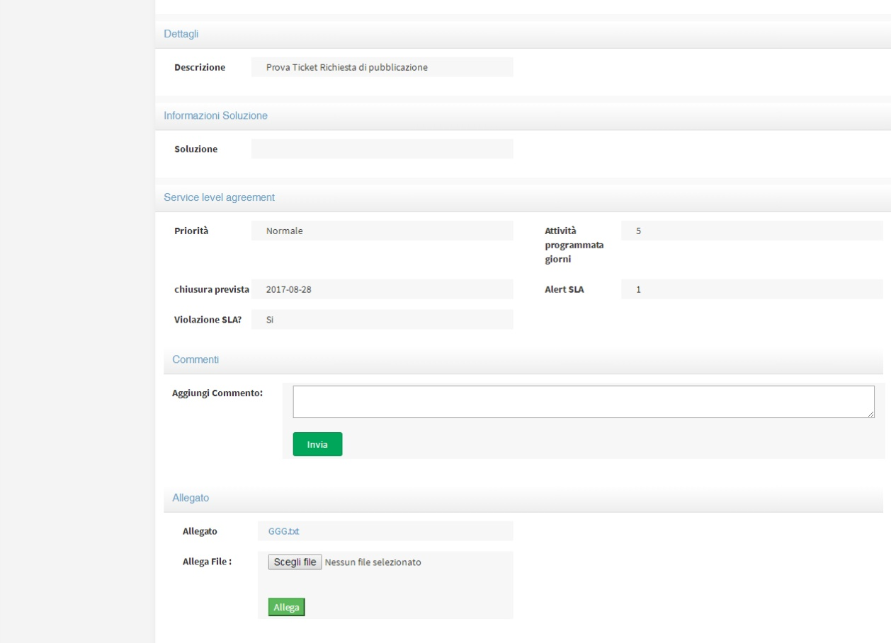
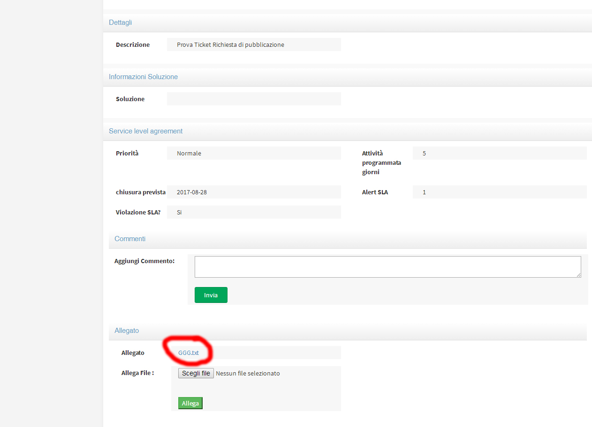

.. _aggiungere-un-allegato:

4.2 Aggiungere un allegato
==========================

Per poter aggiungere un allegato è necessario aprire il ticket già creato e seguire le indicazioni all'interno del ticket stesso pulsante **"Scegli file"** e poi **"Allega".**

|Aggiungere Allegato Portale Utenti|

Figura 13 – Aggiungi allegato

Il documento aggiunto sarà visibile e consultabile con un click

|Visualizza Allegato Portale Utenti|

Figura 14 – visualizza allegato

