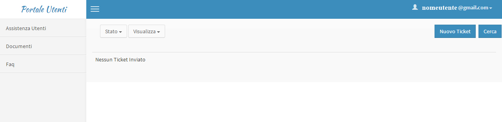
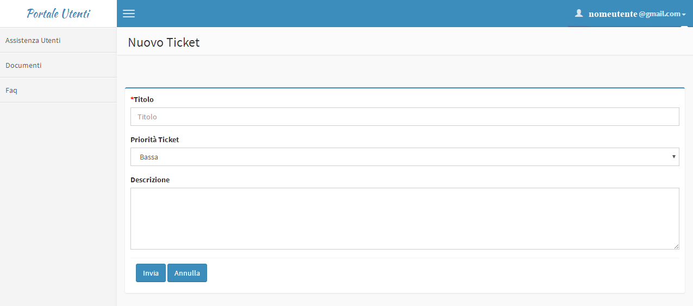

.. _creare-un-ticket:

4.1 Creare un ticket
====================

Nella sezione "Assistenza Utenti" sarà possibile creare un nuovo ticket

Basterà cliccare sul pulsante in alto a destra\ **"Nuovo Ticket"**

|pulsante crea nuovo ticket|

Figura - Pulsante nuovo Ticket

compilare i campi avendo cura di inserire il titolo, la priorità [1]_ e una descrizione della richiesta

|Nuovo Ticket|

Figura 12 – Nuovo Ticket

Una volta completato con la compilazione dei dati premere il pulsante **"Invia"**

.. [1]
    Riguardo la scelta della priorità consultare il `Contratto di Servizio SLA <http://www.cittametropolitana.na.it/documents/10181/1945800/Contratto+di+servizio+V1.pdf/474d4d7b-6b89-4458-a8b9-8103dae513c2>`__

