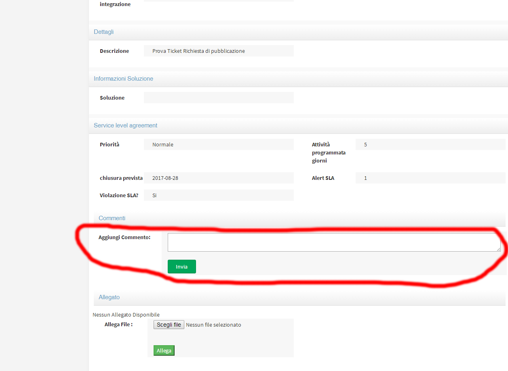

.. _inviare-un-commento:

4.3 Inviare un commento
=======================

Per le comunicazioni bidirezionali tra il richiedente e l'assegnatario si è scelto di utilizzare il box dei commenti. Quando viene aggiunto un commento il ricevente avrà una notifica via mail, provvederà a rispondere sempre accedendo al portale e usando il ticket in questione.

|Invia Commento Portale Utenti|

Figura 15 – Inviare commento

