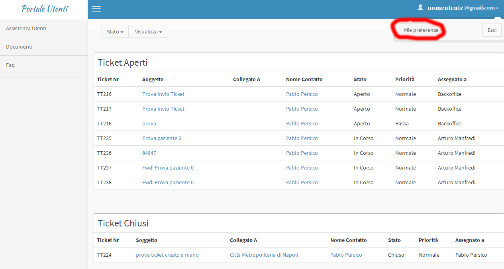

.. _cambio-password:

3.3 Cambio Password
===================

Una volta avuto accesso al portale è consigliato cambiare la password di accesso. In alto a destra sotto la voce recante il vostro indirizzo mail troverete un menù, scegliete la voce **"Mie preferenze"**

|image0|\ |Mie Preferenze Portale Utenti|

Figura - Mie Preferenze e dettaglio

Nella pagina che si aprirà troverete i campi **"vecchia password"** e **"nuova password"** da dover compilare.

|Cambio Password Portale Utenti|

Figura - Cambio Password

.. |Cambio Password Portale Utenti| image:: .././media/image11.jpeg
   :width: 5.94792in
   :height: 3.74792in
