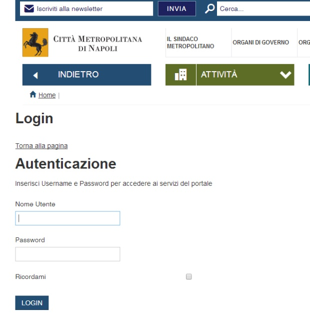
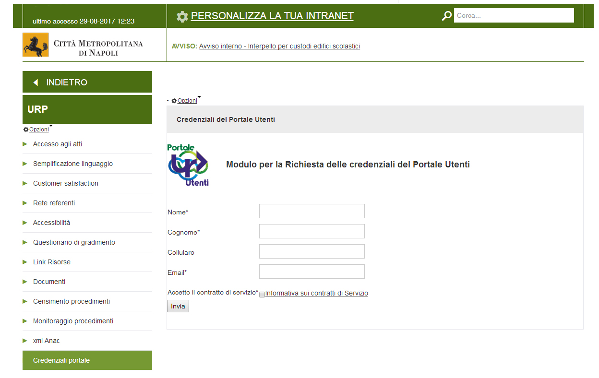
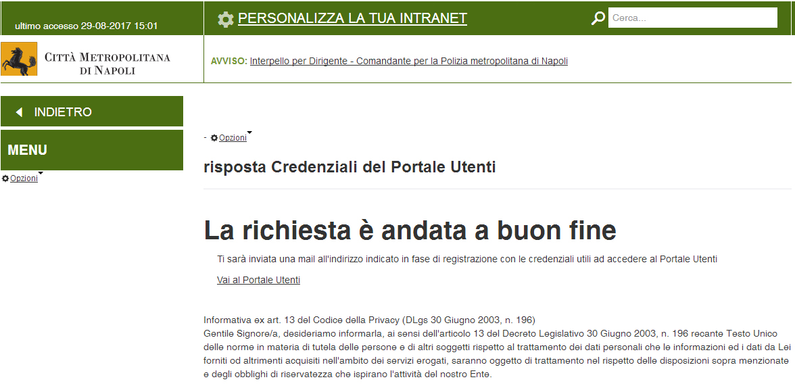

.. _registrazione-al-portale-utenti:

3.1 Registrazione al Portale Utenti
===================================

La registrazione può essere effettuata all'indirizzo http://www.cittametropolitana.na.it/group/intranet/credenziali-portale

previa autenticazione al portale Intranet

|Credenziali intranet Portale Istituzionale Città Metropolitana di Napoli|

Figura 2 – Credenziali Portale Intranet

Il form è raggiungibile anche dall'area **Intranet** del sito istituzionale

alla sezione "**Urp"** sotto la voce **"credenziali portale"**

|WebForm registrazione credenziali Portale Utenti|

Figura 3 – Web form richiesta credenziali

Una volta completato il form e inviati i dati verrete reindirizzati su una pagina che vi confermerà l'avvenuta iscrizione

|corretto invio dati per registrazione al Portale Utenti|

Figura 4 – Esito positivo richiesta credenziali

