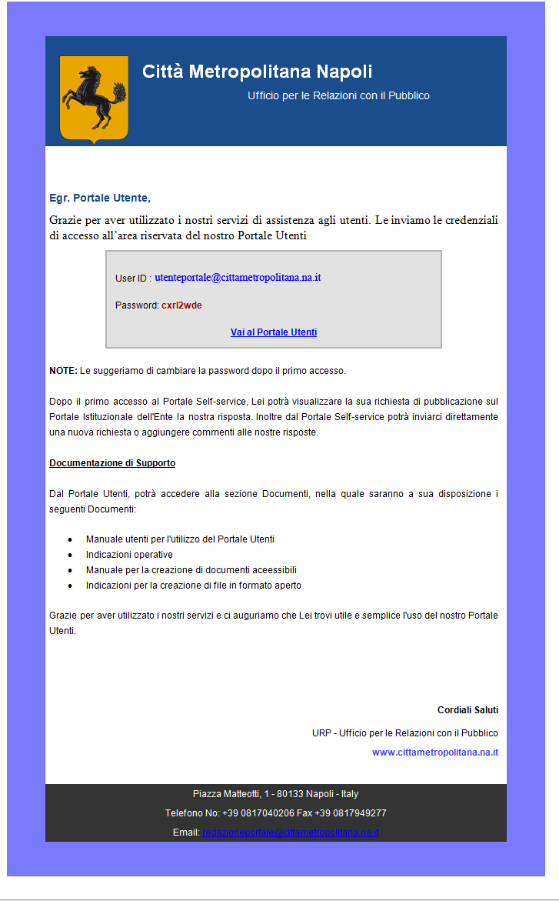
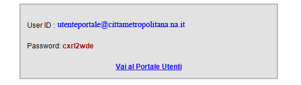

.. _ricezione-credenziali:

3.2 Ricezione Credenziali
=========================

Dopo l'invio dei dati, verrà immediatamente recapitata una e-mail all'indirizzo indicato, con le credenziali utili per l'accesso al portale

|Email invio credenziali Portale Utenti|

Figura 5 – Email credenziali

dall'email si potrà raggiungere direttamente il portale attraverso il link posto in basso "**Vai al Portale Utenti**".

|dettaglio credenziali Portale Utenti e link|

Figura - dettaglio email credenziali portale

