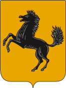

CRM 001/2017 v1

|Stemma Città Metropolitana di Napoli|

Manuale uso CRM Portale Utenti

**Manuale gestione CRM**

**Destinatari:** Utenti interni Portale Istituzionale

**Autore:** Ufficio per le Relazioni con il Pubblico

**Data di rilascio:** 12/09/2017

+----------------+-----------------------------------+
| **Proprietà:** | Città Metropolitana di Napoli Urp |
+----------------+-----------------------------------+

**Versioni**

+----------+------------+------------------------------+-----------------------------------+
| Versione | Data       | Descrizione                  | Autore                            |
+==========+============+==============================+===================================+
| 1.0      | 23/08/2017 | Manuale CRM e portale utenti | Ufficio Relazioni con il Pubblico |
+----------+------------+------------------------------+-----------------------------------+
| 1.1      | 05/09/2017 | Manuale CRM e portale utenti |                                   |
+----------+------------+------------------------------+-----------------------------------+
| 1.2      | 13/09/2017 | Manuale CRM e portale utenti | Pablo Persico                     |
+----------+------------+------------------------------+-----------------------------------+

.. toctree::
   :maxdepth: 3
   :caption: Indice dei contenuti
   :numbered: 

   sommario.rst
   indice-delle-figure.rst
   introduzione.rst
   a-cosa-serve-il-portale-utenti.rst
   credenziali-di-accesso.rst
   accesso-al-portale-utenti.rst
   assistenza-portale-utenti.rst

