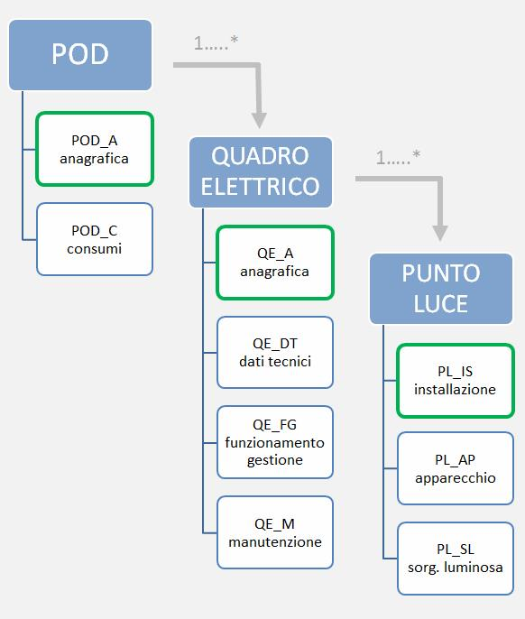

.. _tema-illuminazione-pubblica-0708:

TEMA: Illuminazione pubblica 0708
=================================

**Descrizione**

Questo tema definisce l'organizzazione del sistema di rilevamento degli impianti di illuminazione al servizio di vie e piazze pubbliche, di luoghi pubblici in genere, comprese le aree di pertinenza, i cui costi energetici e manutentivi sono sostenuti direttamente o, tramite concessione, da enti locali, compresi gli impianti corredati da sistemi di rilevazione del fabbisogno d'illuminazione e conseguenti meccanismi di regolazione dell'intensità del flusso luminoso. I concetti su cui si fonda la strutturazione del tema, riguardano le modalità con cui devono essere descritti gli elementi utili alla conoscenza ed al monitoraggio del processo gestionale delle infrastrutture e dei servizi di pubblica illuminazione.

La strutturazione in Classi considera sia l'esigenza di censire puntualmente i dati degli impianti (POD, quadri elettrici e punti luce), sia le conoscenza del contesto territoriale in cui gli stessi sono collocati (zone omogenee e altre Classi del soprasuolo) al fine di rendere più efficaci gli impianti rispondendo in maniera più efficiente alle esigenze dei cittadini e del Paese.

**Figure**

- Schema organizzativo del tema

|image0|

.. toctree::
   :maxdepth: 3

   tema-illuminazione-pubblica-0708/classe-pod-anagrafica-del-punto-di-prelievo-dellel.rst
   tema-illuminazione-pubblica-0708/classe-pod---consumi-pod_c---070803.rst
   tema-illuminazione-pubblica-0708/classe-quadro-elettrico-anagrafica-qe_a---070805.rst
   tema-illuminazione-pubblica-0708/classe-dati-tecnici-quadro-elettrico-qe_dt---07080.rst
   tema-illuminazione-pubblica-0708/classe-dati-funzionamento-e-gestione-del-quadro-el.rst
   tema-illuminazione-pubblica-0708/classe-quadro-elettrico-manutenzione-qe_m---070808.rst
   tema-illuminazione-pubblica-0708/classe-punto-luce-installazione-pl_is---070809.rst
   tema-illuminazione-pubblica-0708/classe-punto-luce-apparecchio-pl_ap---070810.rst
   tema-illuminazione-pubblica-0708/classe-punto-luce-sorgente-luminosa-pl_sl---070811.rst
   tema-illuminazione-pubblica-0708/classe-zone-omogenee-zo---070812.rst

