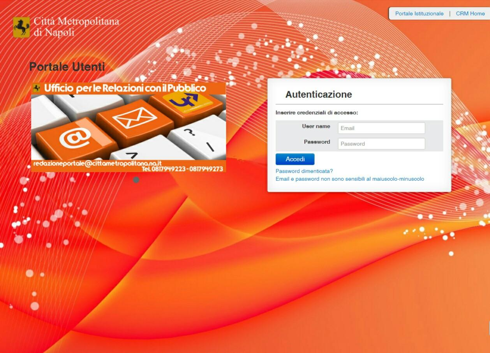
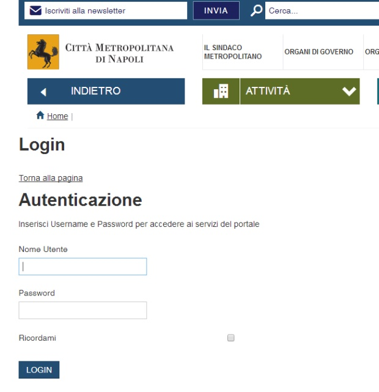
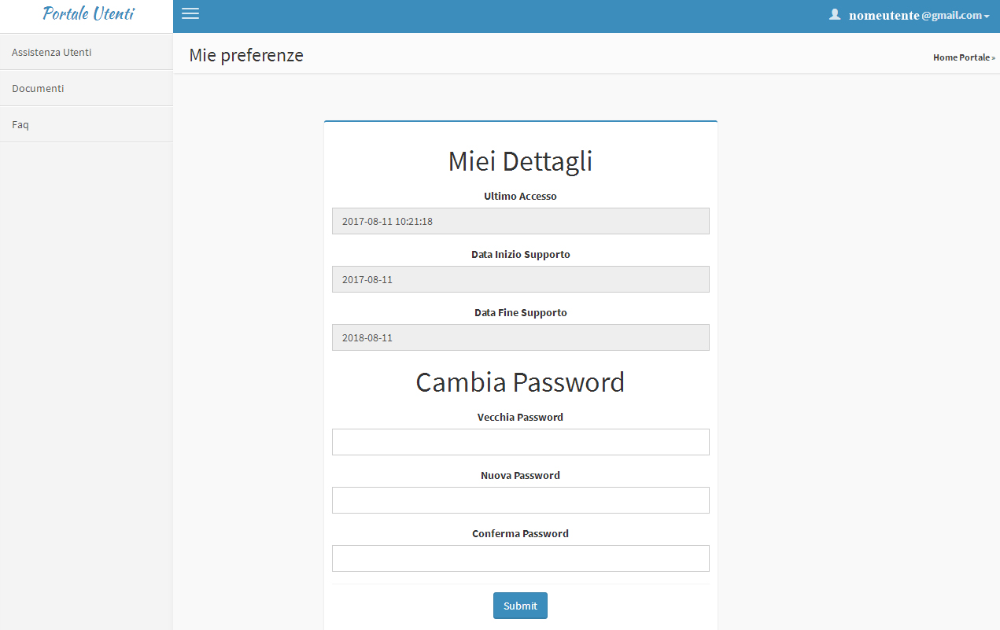
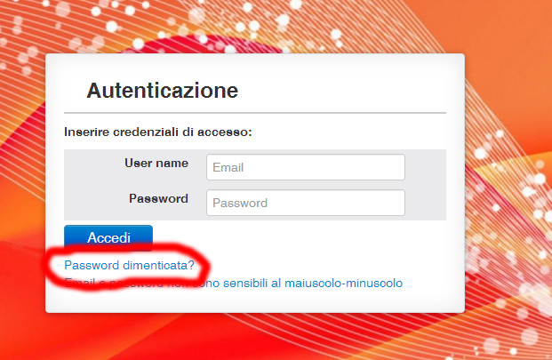
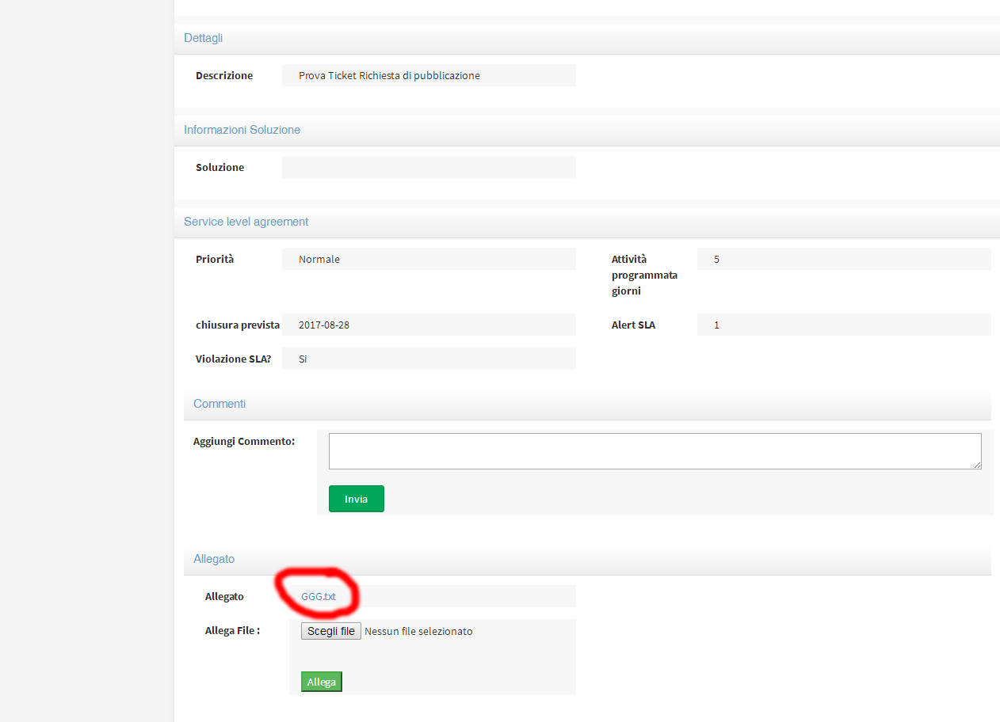

CRM 001/2017 v1

|Stemma Città Metropolitana di Napoli|

Manuale uso CRM Portale Utenti

**Manuale gestione CRM**

**Destinatari:** Utenti interni Portale Istituzionale

**Autore:** Ufficio per le Relazioni con il Pubblico

**Data di rilascio:** 12/09/2017

+----------------+-----------------------------------+
| **Proprietà:** | Città Metropolitana di Napoli Urp |
+----------------+-----------------------------------+

**Versioni**

+----------+------------+------------------------------+-----------------------------------+
| Versione | Data       | Descrizione                  | Autore                            |
+==========+============+==============================+===================================+
| 1.0      | 23/08/2017 | Manuale CRM e portale utenti | Ufficio Relazioni con il Pubblico |
+----------+------------+------------------------------+-----------------------------------+
| 1.1      | 05/09/2017 | Manuale CRM e portale utenti |                                   |
+----------+------------+------------------------------+-----------------------------------+
| 1.2      | 13/09/2017 | Manuale CRM e portale utenti | Pablo Persico                     |
+----------+------------+------------------------------+-----------------------------------+

*
*\ Sommario
===========

`1. Introduzione 3 <#introduzione>`__

`2. A cosa serve il Portale Utenti 3 <#a-cosa-serve-il-portale-utenti>`__

`3. Credenziali di accesso 4 <#credenziali-di-accesso>`__

`3.1 Registrazione al Portale Utenti 4 <#registrazione-al-portale-utenti>`__

`3.2 Ricezione Credenziali 6 <#ricezione-credenziali>`__

`3.3 Cambio Password 7 <#cambio-password>`__

`3.4 Password dimenticata 8 <#password-dimenticata>`__

`4. Accesso al Portale Utenti 9 <#accesso-al-portale-utenti>`__

`4.1 Creare un ticket 9 <#creare-un-ticket>`__

`4.2 Aggiungere un allegato 10 <#aggiungere-un-allegato>`__

`4.3 Inviare un commento 11 <#inviare-un-commento>`__

`4.4 Documenti e Faq 12 <#documenti-e-faq>`__

`5. Assistenza Portale Utenti 12 <#assistenza-portale-utenti>`__

Indice delle Figure
===================

`Figura 1 – Home Portale Utenti 3 <#_Toc492390621>`__

`Figura 2 – Credenziali Portale Intranet 4 <#_Toc492390622>`__

`Figura 3 – Web form richiesta credenziali 5 <#_Toc492390623>`__

`Figura 4 – Esito positivo richiesta credenziali 5 <#_Toc492390624>`__

`Figura 5 – Email credenziali 6 <#_Toc492390625>`__

`Figura 6 - dettaglio email credenziali portale 7 <#_Toc493066160>`__

`Figura 7 - Mie Preferenze e dettaglio 7 <#_Toc493066161>`__

`Figura 8 - Cambio Password 8 <#_Toc493066162>`__

`Figura 9 - Password dimenticata 8 <#_Toc493066163>`__

`Figura 10 - home page Assistenza Utenti 9 <#_Toc493066164>`__

`Figura 11 - Pulsante nuovo Ticket 9 <#_Toc493066165>`__

`Figura 12 – Nuovo Ticket 10 <#_Toc493066166>`__

`Figura 13 – Aggiungi allegato 10 <#_Toc492390633>`__

`Figura 14 – visualizza allegato 11 <#_Toc492390634>`__

`Figura 15 – Inviare commento 11 <#_Toc492390635>`__

`Figura 16 – Sezioni del Portale Utenti 12 <#_Toc492390631>`__

|image1|\ 1. Introduzione
=========================

L’ufficio Urp ha istituito un servizio per le richieste di pubblicazioni sul portale istituzionale basato su un’applicazione **CRM Customer Relationship Management** principalmente usato nelle aziende per “Gestire in modo efficace i rapporti con i propri clienti”. Il **CRM** usato è **Vtiger**, l’ufficio **Urp** ha “modellato” questo applicativo per adattarlo alla gestione degli utenti interni che quotidianamente effettuano richieste di pubblicazioni sul portale istituzionale `www.cittametropolitana.na.it <http://www.cittametropolitana.na.it>`__.

Per la gestione, tra l’utente che effettua la richiesta e il dipendente dell’ufficio **Urp** che gestisce e processa la pubblicazione, è stato creato il Portale Utenti, un portale che consente la gestione personalizzata delle singole richieste di pubblicazione.

|Home Page Portale Utenti|

Figura 1 – Home Portale Utenti

2. A cosa serve il Portale Utenti
=================================

Il **Portale Utenti di vTiger CRM** si dimostrerà molto utile per implementare un sistema di ticketing, una area privata per ogni utente che consenta di accedere a tutte le richieste effettuate, ai documenti inviati e alla manualistica, procedure ecc.

Il **Portale Utenti di vTiger CRM** permette principalmente di generare Ticket di supporto. A seguito della creazione del Ticket, riceverete sul nostro CRM e su Email la notifica e potrete verificare lo stato e interloquire con l’Urp .

Questo è solo l'inizio, perché il **Portale Utenti di vTiger CRM** offre anche i seguenti vantaggi:

1. **Nessun rischio di smarrimento:** Tutte le comunicazioni tra Urp e Utenti vengono registrate in una pagina personale riservata;

2. **Efficienza e risparmio di tempo:** Il Portale Clienti permette di gestire anche grandi quantità di richieste essendo sempre chiaro e semplice nei processi. Questo significa un risparmio in termini di tempo e risorse.

3. **Ticket consultabili nel tempo:** Al contrario delle email, che possono essere smarrite, i Ticket di assistenza creati attraverso il Portale Clienti rimarranno memorizzate per future referenze;

4. **Multicanalità:** Ogni Ticket verrà assegnato al personale di competenza in maniera immediata e ogni utente avrà la possibilità di verificare lo stato di avanzamento della richiesta, il nome del responsabile a cui è assegnato il ticket, i tempi di lavorazione programmati e quelli realmente impiegati, anche attraverso mail e sms;

5. **Possibilità di Allegati:** Il Portale Clienti di vTiger CRM gestisce al meglio gli allegati e permette di ricevere ogni tipo di file da parte vostra

6. **Pagina web riservata:** Ogni Utente riceverà l'accesso ad una pagina web personale dove poter inserire, ogni qualvolta si rendesse necessario, i Ticket di richiesta di pubblicazione o assistenza, consultare lo stato dei precedenti e chattare in tempo reale con l’Urp attraverso i commenti;

7. **Assistenza monitorata:** E' possibile verificare l'andamento e la capacità da parte del Team di lavoro nella risoluzione dei Ticket e la conformità al Contratto di Servizio (SLA) [1]_

3. Credenziali di accesso
=========================

L’utente interessato ad utilizzare il Portale Utenti deve effettuare la registrazione per ottenere le credenziali di accesso.

3.1 Registrazione al Portale Utenti
-----------------------------------

La registrazione può essere effettuata all’indirizzo http://www.cittametropolitana.na.it/group/intranet/credenziali-portale

previa autenticazione al portale Intranet

|Credenziali intranet Portale Istituzionale Città Metropolitana di Napoli|

Figura 2 – Credenziali Portale Intranet

Il form è raggiungibile anche dall’area **Intranet** del sito istituzionale

alla sezione “\ **Urp”** sotto la voce **“credenziali portale”**

|WebForm registrazione credenziali Portale Utenti|

Figura 3 – Web form richiesta credenziali

Una volta completato il form e inviati i dati verrete reindirizzati su una pagina che vi confermerà l’avvenuta iscrizione

|corretto invio dati per registrazione al Portale Utenti|

Figura 4 – Esito positivo richiesta credenziali

3.2 Ricezione Credenziali
-------------------------

Dopo l’invio dei dati, verrà immediatamente recapitata una e-mail all’indirizzo indicato, con le credenziali utili per l’accesso al portale

|Email invio credenziali Portale Utenti|

Figura 5 – Email credenziali

dall’email si potrà raggiungere direttamente il portale attraverso il link posto in basso “\ **Vai al Portale Utenti**\ ”.

|dettaglio credenziali Portale Utenti e link|

Figura - dettaglio email credenziali portale

3.3 Cambio Password
-------------------

Una volta avuto accesso al portale è consigliato cambiare la password di accesso. In alto a destra sotto la voce recante il vostro indirizzo mail troverete un menù, scegliete la voce **“Mie preferenze”**

|image8|\ |Mie Preferenze Portale Utenti|

Figura - Mie Preferenze e dettaglio

Nella pagina che si aprirà troverete i campi **“vecchia password”** e **“nuova password”** da dover compilare.

|Cambio Password Portale Utenti|

Figura - Cambio Password

3.4 Password dimenticata
------------------------

|image11|\ |Password dimenticata|

Figura - Password dimenticata

Per il recupero della password è necessario cliccare sul link **“password dimenticata?”** che troverete sotto il pannello di inserimento delle credenziali nella home page del portale utenti Da lì verrete reindirizzati su una pagina dove vi verrà chiesto di inserire l’indirizzo email e dopo aver cliccato sul pulsante invia password vi verrà recapitata una nuova password.

4. Accesso al Portale Utenti
============================

Inserite le credenziali si accederà al portale

|Assistenza Utenti Portale Utente|

Figura - home page Assistenza Utenti

Per uscire correttamente dal portale cliccare in alto a destra nel menu recante il vostro indirizzo mail e scegliere la voce **“esci”**

4.1 Creare un ticket
--------------------

Nella sezione “Assistenza Utenti” sarà possibile creare un nuovo ticket

Basterà cliccare sul pulsante in alto a destra\ **“Nuovo Ticket”**

|pulsante crea nuovo ticket|

Figura - Pulsante nuovo Ticket

compilare i campi avendo cura di inserire il titolo, la priorità [2]_ e una descrizione della richiesta

|Nuovo Ticket|

Figura 12 – Nuovo Ticket

Una volta completato con la compilazione dei dati premere il pulsante **“Invia”**

4.2 Aggiungere un allegato
--------------------------

Per poter aggiungere un allegato è necessario aprire il ticket già creato e seguire le indicazioni all'interno del ticket stesso pulsante **“Scegli file”** e poi **“Allega”.**

|Aggiungere Allegato Portale Utenti|

Figura 13 – Aggiungi allegato

Il documento aggiunto sarà visibile e consultabile con un click

|Visualizza Allegato Portale Utenti|

Figura 14 – visualizza allegato

4.3 Inviare un commento
-----------------------

Per le comunicazioni bidirezionali tra il richiedente e l’assegnatario si è scelto di utilizzare il box dei commenti. Quando viene aggiunto un commento il ricevente avrà una notifica via mail, provvederà a rispondere sempre accedendo al portale e usando il ticket in questione.

|Invia Commento Portale Utenti|

Figura 15 – Inviare commento

4.4 Documenti e Faq
-------------------

|Sezioni Portale Utenti|

Figura 16 – Sezioni del Portale Utenti

Nella sezione Documenti sarà possibile trovare il manuale del Portale Utente, il Contratto di Servizio SLA e le schede delle Faq in formato pdf stampabile, mentre nella sezione Faq troverete utili vademecum sui documenti accessibili. Entrambe le sezioni saranno aggiornate periodicamente anche grazie al contributo degli utenti stessi.

5. Assistenza Portale Utenti
============================

|banner assistenza Utenti|

Per l’assistenza si possono contattare i riferimenti suindicati. Per agevolare l'assistenza e rispondere in maniera rapida alle eventuali perplessità è stato creato un gruppo su Workplace [3]_ basta richiedere l’invito all’indirizzo: https://fb.me/g/yJjMAKNX/bG1ENLxK

Nel gruppo si potranno trovare oltre ai documenti già presenti nel Portale Utente, screenshot e mappe mentali relativi allo sviluppo dei workflow, inoltre verrà fornita tutta l’assistenza necessaria al corretto utilizzo del Portale.

.. [1]
    `Contratto di Servizio SLA <http://www.cittametropolitana.na.it/documents/10181/1945800/Contratto+di+servizio+V1.pdf/474d4d7b-6b89-4458-a8b9-8103dae513c2>`__

.. [2]
    Riguardo la scelta della priorità consultare il `Contratto di Servizio SLA <http://www.cittametropolitana.na.it/documents/10181/1945800/Contratto+di+servizio+V1.pdf/474d4d7b-6b89-4458-a8b9-8103dae513c2>`__

.. [3]
    `Cos’è Workplace di Facebook? <https://it-it.facebook.com/help/work/791147577614860>`__

.. |Stemma Città Metropolitana di Napoli| image:: ./media/image1.png
   :width: 0.6in
   :height: 0.79097in

.. |corretto invio dati per registrazione al Portale Utenti| image:: ./media/image6.jpeg
   :width: 6.26944in
   :height: 3.06111in
.. |Email invio credenziali Portale Utenti| image:: ./media/image7.jpeg
   :width: 5.77361in
   :height: 8.35625in

.. |image8| image:: ./media/image9.jpeg
   :width: 4.58264in
   :height: 2.15625in
.. |Mie Preferenze Portale Utenti| image:: ./media/image10.jpeg
   :width: 6.26944in
   :height: 3.34792in

.. |image11| image:: ./media/image12.jpeg
   :width: 3.45069in
   :height: 2.54167in

.. |Assistenza Utenti Portale Utente| image:: ./media/image14.jpeg
   :width: 6.26944in
   :height: 3.34792in

.. |Nuovo Ticket| image:: ./media/image16.jpeg
   :width: 6.26944in
   :height: 2.77361in

.. |Invia Commento Portale Utenti| image:: ./media/image19.jpeg
   :width: 6.26944in
   :height: 4.59097in
.. |Sezioni Portale Utenti| image:: ./media/image20.jpeg
   :width: 3.04375in
   :height: 2.91319in
.. |banner assistenza Utenti| image:: ./media/image21.jpeg
   :width: 6.26944in
   :height: 1.47847in
