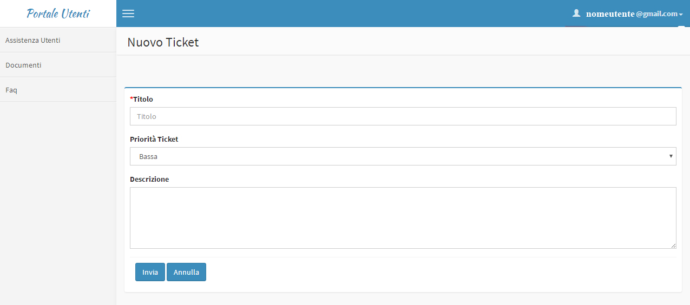
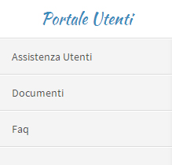

4. Accesso al Portale Utenti
============================

Inserite le credenziali si accederà al portale

|Assistenza Utenti Portale Utente|

Figura - home page Assistenza Utenti

Per uscire correttamente dal portale cliccare in alto a destra nel menu recante il vostro indirizzo mail e scegliere la voce **“esci”**

4.1 Creare un ticket
--------------------

Nella sezione “Assistenza Utenti” sarà possibile creare un nuovo ticket

Basterà cliccare sul pulsante in alto a destra\ **“Nuovo Ticket”**

|pulsante crea nuovo ticket|

Figura - Pulsante nuovo Ticket

compilare i campi avendo cura di inserire il titolo, la priorità [1]_ e una descrizione della richiesta

|Nuovo Ticket|

Figura 12 – Nuovo Ticket

Una volta completato con la compilazione dei dati premere il pulsante **“Invia”**

4.2 Aggiungere un allegato
--------------------------

Per poter aggiungere un allegato è necessario aprire il ticket già creato e seguire le indicazioni all'interno del ticket stesso pulsante **“Scegli file”** e poi **“Allega”.**

|Aggiungere Allegato Portale Utenti|

Figura 13 – Aggiungi allegato

Il documento aggiunto sarà visibile e consultabile con un click

|Visualizza Allegato Portale Utenti|

Figura 14 – visualizza allegato

4.3 Inviare un commento
-----------------------

Per le comunicazioni bidirezionali tra il richiedente e l’assegnatario si è scelto di utilizzare il box dei commenti. Quando viene aggiunto un commento il ricevente avrà una notifica via mail, provvederà a rispondere sempre accedendo al portale e usando il ticket in questione.

|Invia Commento Portale Utenti|

Figura 15 – Inviare commento

4.4 Documenti e Faq
-------------------

|Sezioni Portale Utenti|

Figura 16 – Sezioni del Portale Utenti

Nella sezione Documenti sarà possibile trovare il manuale del Portale Utente, il Contratto di Servizio SLA e le schede delle Faq in formato pdf stampabile, mentre nella sezione Faq troverete utili vademecum sui documenti accessibili. Entrambe le sezioni saranno aggiornate periodicamente anche grazie al contributo degli utenti stessi.

.. [1]
   Riguardo la scelta della priorità consultare il `Contratto di Servizio SLA <http://www.cittametropolitana.na.it/documents/10181/1945800/Contratto+di+servizio+V1.pdf/474d4d7b-6b89-4458-a8b9-8103dae513c2>`__

.. |Assistenza Utenti Portale Utente| image:: ./media/image14.jpeg
   :width: 6.26944in
   :height: 3.34792in
.. |pulsante crea nuovo ticket| image:: ./media/image15.jpeg
   :width: 2.11319in
   :height: 1.53056in

.. |Aggiungere Allegato Portale Utenti| image:: ./media/image17.jpeg
   :width: 5.72153in
   :height: 4.13889in
.. |Visualizza Allegato Portale Utenti| image:: ./media/image18.jpeg
   :width: 5.99097in
   :height: 3.07847in
.. |Invia Commento Portale Utenti| image:: ./media/image19.jpeg
   :width: 6.26944in
   :height: 4.59097in
