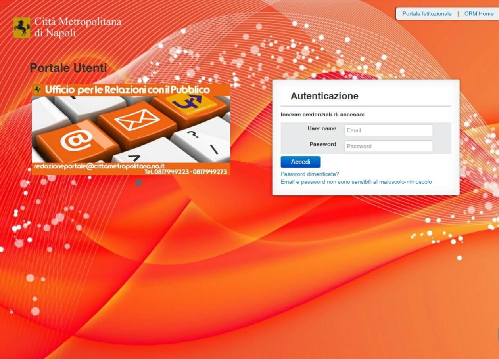

|image1|\ 1. Introduzione
=========================

L’ufficio Urp ha istituito un servizio per le richieste di pubblicazioni sul portale istituzionale basato su un’applicazione **CRM Customer Relationship Management** principalmente usato nelle aziende per “Gestire in modo efficace i rapporti con i propri clienti”. Il **CRM** usato è **Vtiger**, l’ufficio **Urp** ha “modellato” questo applicativo per adattarlo alla gestione degli utenti interni che quotidianamente effettuano richieste di pubblicazioni sul portale istituzionale `www.cittametropolitana.na.it <http://www.cittametropolitana.na.it>`__.

Per la gestione, tra l’utente che effettua la richiesta e il dipendente dell’ufficio **Urp** che gestisce e processa la pubblicazione, è stato creato il Portale Utenti, un portale che consente la gestione personalizzata delle singole richieste di pubblicazione.

|Home Page Portale Utenti|

Figura 1 – Home Portale Utenti

.. |image1| image:: ./media/image2.jpeg
   :width: 0.55278in
   :height: 0.56528in
